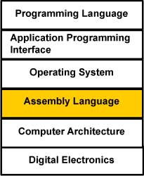

# Chapter 1 - Introduction

Assembly language is used to write programs in terms of the basic operations of a processor. These notes are in the assembly language 
for the ARM processor chip. We will not cover the entirety of the instructions for this chip -- not even close, in fact!  Modern chips are incredibly complex.  However, these notes use actual ARM hardware in the form of a Raspberry Pi.

The **architecture** of a computer is a logical description of its components and its basic operations. In pure assembly 
language one assembly language statement corresponds to one basic operation of the processor. When a programmer writes in 
assembly language the programmer is asking for the basic operations of the processor. The architecture of the processor is 
visible in every statement of the program.

Pure assembly language is rare. Most application programs are written in a **high level language**. Even when assembly language is used 
it usually has been enhanced. Features are added to it to make it more programmer-friendly. This **extended assembly language** 
includes statements that correspond to several basic machine operations. The ARM extended assembly language does this, but the 
processor chip is still visible.

Programs in high level languages such as C or Pascal are (somewhat) independent of the processor they run on. Programs in 
Java are totally independent of the processor. But in assembly language the program is written totally in terms of the 
processor. This chapter starts our tour of assembly language.

Chapter Topics:
* The Basic Computer Cycle
* Machine Instructions
* Machine Language
* Assembly Language
* Language Translation
* Emulation
* Object Modules and Load Modules
* Separate Assembly

### Review Question:
<details>
  <summary>Q: Do all processor chips have the same architecture? </summary>
  A: No. Each family of processor chip (MIPS, PIC, SPARC, Alpha, Motorola, Intel, et al.) has its own architecture
</details>

## 1.1 Different Processor Architectures
As we just said, the **architecture** of a processor chip is a description of its basic components and of its basic operations.

Each processor family has its own architecture. Assembly language is a programming view of the architecture of a particular processor. Each type of processor has its own assembly language.

When you study an assembly language, you study the architecture of a particular processor. The study of any assembly language increases your professional understanding of computers. These notes are about the ARM processor, which is a nice processor to study. The concepts in ARM assembly are universal.



These notes discuss assembly language from a computer science perspective. They explain what is going on in a computer system at the **assembly language level**. This is a view that is above the electronic view of computer architecture (found somewhat in our MAT310 course), but is below the operating systems view of the computer system (found in CMS 330). Computer scientists understand computers at many levels. They understand how the many levels are built one on top of another. Each of these levels corresponds to one or more courses in a computer science degree program.

## 1.2 Fundamentals
The ARM architecture is modern and well-designed. The ARM chip was designed from the ground up in 1990. Its design includes the best ideas of computer architecture. It may surprise you that something done in 1990 could be called "modern". However, the fundamentals of any science change slowly, if at all. The ARM is an excellent chip to study if you want to learn the fundamentals of how computers work.

An assembly language program describes exactly what the hardware should do, step by step, in terms of the basic operations of the hardware. In a high level programming language like C or Java a programmer is mostly unaware of computer architecture. The purpose of a high level language is that the same source program can run (after compiling) on any processor family.  But first it must be translated into **machine code** -- code that a specific processor understands.

The set of specific instructions the processor understands are called the **instruction set** of the processor. Each make of processor has a different instruction set.

These notes are about fundamental assembly-level computer architecture. To do this effectively, it is necessary to actually learn the assembly language and details of a particular processor, and to write programs for it. This is somewhat like those experiments you did in high school chemistry. Their goal was to teach you the fundamentals of chemistry, not to teach you how to make test tubes full of colorful water and salt. But without the colorful experiments your understanding of chemistry might remain abstract and vague, and would soon be forgotten.

## 1.3 Basic Machine Cycle
Most processors endlessly repeat three basic steps. Each **machine cycle** results in the execution of one *machine instruction*.  However, a modern processor performs millions of machine cycles per second.

A **machine instruction** is a pattern of bits that corresponds to a fundamental operation of the processor such as adding two 32-bit integers together or testing if a value is zero. The details of the machine cycle differ between processor families. The machine cycle of most processor chips looks like the following:


1. **Fetch the Instruction**: The instruction (pattern of bits) is fetched from memory. The **program counter (PC)** is part of the processor. It contains the address of the instruction to fetch in memory.  After the instruction is fetched from memory, the program counter is incremented and now points to the next instruction to be fetched.
2. **Decode the Instruction**: The processor must now make sense of the instruction it just fetched.
As we have seen, the processor is designed to understand a specific set of commands called the instruction set of the processor. The processor decodes the instruction and prepares various areas within the chip for the next step.
3. **Execute the Instruction**: The operation asked for by the current machine instruction is performed -- eg adding two numbers or testing if a number is equal to 0.

On a 32-bit processor, memory addresses are 32 bits wide and so the program counter (PC) holds a 32 bit address.

### Thought Question:
<details>
  <summary>Q: In what order are machine instructions executed by the basic machine cycle?</summary>
  A: In sequential order, one after another.
</details>

## 1.4 Machine Instructions
Instructions are normally executed in sequence. The program counter advances forward through memory one instruction at a time. Each time an instruction is executed, the next one is automatically selected for the next execution cycle.

Operations like "add two integers" and "compare two integers" are operations that a processor does in one machine cycle. Loops and branches require machine instructions that alter the normal sequence.

A machine instruction is a pattern of bits that directs the processor to perform one machine operation. Here is the machine instruction that directs the ARM processor to subtract two 32-bit registers (a **register** is a part of the processor that stores a bit pattern).

`1110 0000 0100 0011 0011 0000 0000 0000` 

The instruction is 32 bits long. Each bit is 0 or 1. When bit patterns are displayed in a book they are usually shown in groups of four (as here). Of course, the spaces between groups are a convention of printing and are not actually part of the bit pattern.

Some of the bits in the instruction specify the operation (adding two registers), other bits specify which two registers to add. A few more bits say where to put the result.

### Thought Question:
<details>
  <summary>Q: Inspect the instruction. Is it clear what the bits of the instruction mean?</summary>
  A: No.  It would be very helpful (to us humans) to have a reference document to help us understand what a bit pattern corresponded to in a high level language.
</details>

## 1.5 Assembly Language Statement
The layout of a machine instruction is part of the architecture of a processor chip. Without knowing the layout you can't tell what the instruction means. Even if you know the layout, it is hard to remember what the patterns mean and hard to write machine instructions.  Chip manufacturers such as Intel and AMD publish reference documents which detail a chip's **instruction set architecture (ISA)**.  You can take a look at [some of the ARM ISA documents](https://developer.arm.com/architectures/instruction-sets) or [some of the Intel ISA documents](https://software.intel.com/en-us/articles/intel-sdm), but be warned, they are very complex and overwhelming for novices.

A statement in pure assembly language corresponds to one machine instruction. Assembly language is much easier to understand and write than machine language. Here is the previous machine instruction and the assembly language that it corresponds to:

| Machine Instruction | assembly language statement           
| ------------- |-------------|
|`1110 0000 0100 0011 0011 0000 0000 0000` |`sub r3, r3, r0`|

The instruction means: subtract the integer in registers `r0` from the integer in `r3` and store the result back into `r3`. To create the machine instruction from the assembly language statement a translation program called an **assembler** is used.

Humans find assembly language much easier to use than machine language for many reasons:
* It is hard for humans to keep track of those ones and zeros.
* By using symbols programmers gain flexibility in describing the computation.
* Assembly language is a compact notation.

**Enhanced assembly language** includes additional convenience features. It has instructions (called **pseudo-instructions**) that correspond to several machine instructions.

### Question:
<details>
  <summary>Q: Once you know assembly language, is it hard to write an assembly language statement?</summary>
  A: No, but you will probably have to use documenation to understand the assembly language features, just like you do when you write a program in a high level language.
</details>

## 1.6 Program Translation
The assembly language statement says the same thing as the machine language instruction, but must be translated into a bit pattern before it can be executed. An assembly language program consists of a series of assembly language statements, statements that define data, and some additional information that helps in the translation. Here is a fragment of an assembly language program and its translation into bit patterns.

| Machine Instructions | Assembly Statements |
|----------------------|-------------------- |
| `1110 0010 0100 0011 0011 0000 0000 0101` | `sub r3, r3, #5` |
| `1110 0000 1000 0010 0011 0000 0000 0011` | `add r3, r2, r3`| 
| `1110 0001 1010 0000 0001 0000 0000 1000` | `mov r1, r8`|
| `1110 0001 0101 0110 0000 0000 0000 0100` | `cmp r6, r4`|

Years ago, to run a program written in FORTRAN you used a compiler to translate the program into assembly language. Then you used an assembler to translate the assembly language into machine language. Finally, you loaded the machine language into the computer's memory and executed your program.

Modern compilers usually translate a source program directly into machine language which is contained in a file called an **object module** (more on this later). But for now let us think about translating FORTRAN into assembly language.

FORTRAN is a high level language. It is intended to run on all types of computers regardless of architecture. FORTRAN statements can be written without knowing the architecture of the computer, and can be run on any computer (after translation).

### Question:
<details>
  <summary>Q: Do you think that languages such as COBOL, C, and Pascal are translated like FORTRAN?</summary>
  A: Yes.  All high level languages must be transformed to machine language before they can be executed.  There are some differences in how this translation occurs (eg. interpretting vs. compiling), but the fact remains that a processor can **ONLY** understand machine language.
</details>

## 1.7 Several Translations
All programming languages other than machine language must be translated into machine language before they can be executed. A high level language is independent of architecture. It requires a specific translator (compiler or interpretter) for each architecture. The more modern the language, the more distant the source code is from the machine language. FORTRAN is 50 years old and is closer to machine language than modern languages. Here is a statement in FORTRAN:

`     result = 6*alpha+beta`

Here is a translation of that statement into ARM assembly language:

```
ldr r0, =alpha
ldr r0, [r0]      ; load value of alpha into r1
ldr r1, =beta
ldr r1, [r1]      ; load value of beta into r1
mul r2, r0, r1    ; multiply alpha and beta and put result in r2
mul r0, r2, #6    ; multiply value in r2 by 6 and store in r0
ldr r1, =result   
str r0, [r1]      ; store value in r0 to variable result
```


Here is a translation of that statement into Digital Equipment Corporation VAX assembly language:

```
MULL3   #6,ALPHA,R5
ADDL3   R5,BETA,RESULT
```

And here is a translation of that statement into MIPS assembly language (a language used in many embedded applications):

```
lw  $t0,alpha           # copy alpha to register $t0
lw  $t1,beta            # copy beta  to register $t1
mul $t2,$t0,6           # multiply $t0 times 6; result in $t2
add $t2,$t2,$t1         # add $t2 and $t1; result in $t2
sw  $t2,result          # copy answer to result
```

### Question
<details>
  <summary>Q: Is the ISA for the VAX similar to that of ARM?</summary>
  A: No. They are separate languages for different processors.
</details>

## 1.8 Machine Language
There is not just one language called "assembly language." Each processor family (such as Intel, VAX, MIPS, ARM, ...) has its own machine instructions and a corresponding assembly language. ARM assembly language is only for ARM processors. The VAX assembly language is only for VAX processors. There is a different assembly language for IBM mainframe computers and others for Intel-based PCs.
<!-- image -->

All processors follow the same basic machine cycle. (See above). The differences between processors are in the details of what operations are done in the "execute" phase of the basic machine cycle.

Assembly language describes computations in terms of the hardware of a particular processor. A high level computer programming language (ideally) describes computations in terms of the problem being solved . Since there are many types problems, there are many high level languages, each designed for particular types of problems. For example, object-oriented languages, describe computations in terms of the objects of the problem and operations with them.

It is much easier to program a computer in a high level language than in assembly language, especially when the programming language matches the problem. There will never be a universal programming language since no one language is best for all problems.


### Question
<details>
  <summary>Q: What type of problem is assembly language best suited for? (This is actually a hard question.)</summary>
  A: Problems that involve the very computer/processor the program is running on.  In other words, ARM assembly is particularly suited if you need a finely-tuned, performance-oriented program to run on an ARM processor. 
</details>

## 1.9 Main Storage
<!-- image? -->
Assembly language does match the problem when the problem is the operation of the computer system. Assembly language is used for operating systems, compilers, communications, low-level graphics, and other programs where the architecture of the processor must be visible. Often with these program the crucial parts are written in assembly and the rest in a high level language (usually C). The most common use of assembly language is in programming **embedded systems**. Here a processor chip is part of a machine built for a specific purpose. Examples are aviation electronics, communication satellites, DVD players, robots, automobile electronics, cell phones, and game consoles. 

Now let us move on to the memory of a computer system. A **bit** is a single on/off value. Early computers had rows of toggle switches (like light switches) which were used to set the values of bits in main memory. You could program these computers by entering the bits of each machine instruction from the front panel switches. A light above each switch showed whether it was on or off (1 or 0). Modern computers have more convenient methods for moving bit patterns into memory.

Eight bits make up a **byte**. The bytes that make up the machine instructions of a program are stored in **main memory** and fetched into the processor as needed. Data is also kept in main memory. Keeping both data and instructions in main memory is one of the characteristics of a **Von Neumann machine**, the name for the basic design of most modern computers.

In the ARM, as in most computers, each byte of main memory has an address. An address is an number that uniquely identifies the byte in main memory. The addresses run from 0 up to about four billion. However, user programs and data (such as you will write) are restricted from using all of those addresses.


<details>
  <summary>Q: Is it necessary to install four billion bytes of RAM on an ARM computer? (Hint: the address range of an ARM is the same as that of a 32-bit Pentium).</summary>
  A: No. Both processors have the same range of logical addresses, but there need not be actual RAM behind each address.
</details>

## 1.10 Architecture vs. Implementation
The architecture of a computer is a logical description of its components and its basic operations.

The ARM family of computers all have very similar assembly-level architecture. This means that all ARM machines can be programmed using (almost) the same assembly language. The actual electronics that implement the architecture may differ greatly between versions of the chip. This is analogous to "car architecture". Two Jaguars may appear the same to a driver (same styling, same user controls, same operation) but have different components under the hood (having either a V-6 or a V-8 engine, for example). The architecture is the same, but the implementation (and performance) is different. Keep this in mind as you visit the used car lots in Silicon Valley.

The architecture of an ARM is different from the architecture of a Pentium. Both are Von Neumann machines, so they look the same in general, but the details of operation are completely different. They have different machine languages, and thus different assembly languages.


### Question:
<details>
  <summary>(Hard Thought Question:) Must a machine language program be run on an actual processor chip (i.e., on hardware)? Hint: Think about Java.</summary>
  No. Sometimes machine instructions (such as Java `.class` files) are interpreted by software.
</details>

## Key Terms to Review
* architecture
* high level language
* assembly language
* machine language/code
* instruction set
* machine cycle
* program counter
* register
* assembler
* compiler
* embedded system
* bit
* byte
* main memory
* Von Neumann machine
