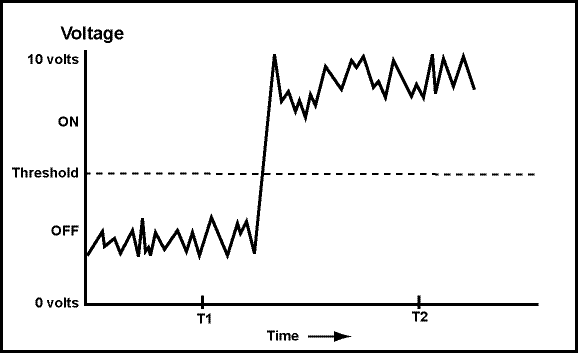

# Chapter 2 - Analog and Binary Signals
Everyone knows that computers are "digital" and that they use "binary" numbers. You probably have some idea of what these terms mean. 
But we need to be clear about their precise meaning and to be clear about why computers are digital.

Chapter Topics:
* Binary signals
* Analog signals
* Advantages of Binary
* Bits
* Noisy signals

### Question

  
 Why is a digital wristwatch called "digital"?

  Because it shows time using definite digits, rather than positions of hands that have to be measured. (It would be less correct to say "because it has a computer inside.")

## 2.1 Binary
Binary means "two states." The two states are sometimes called "1" and "0", or called "true" and "false", or called "on" and "off", (or other names.) The essential characteristic is that a single binary device can be in just one of two possible states.

A bit is a single "on/off" value.

A good example is a toggle switch, such as a light switch. You can turn it "on" or "off" but not (in normal operation) anything else. A light switch holds one bit of information.

A light dimmer is not a binary device: it has many positions between "off" and "fully on". If you want a light dimmer to be set to 25%, you must carefully adjust it.

### Question

Which of the following is a binary device:

A. The ignition switch of an automobile. 
B. The hour hand of a clock. 
C. A button on an electronic calculator. 
D. The volume knob on a stereo. 

C. A button on an electronic calculator

## 2.2 Why Computers use Binary
The ignition switch of an automobile is discrete — it has definite states — but there are usually more than two states (off, running, start, acc...) A button on a calculator is a binary device. It is either on or off. Ordinarily it is "off." When you push it, it is "on." It springs back to "off" when you release it, which is different from a toggle switch, but it still is a binary device.

There are many advantages to binary. Here are four (somewhat overlapping) important reasons for using binary:

1. Simple and easy to build.
2. Unambiguous signals (hence noise immunity).
3. Flawless copies can be made.
4. Anything that can be represented with some sort of pattern can be represented with patterns of bits.

These characteristics of binary were realized by Claude Shannon, a mathematician at Bell Telephone Laboratories. His 1948 paper *A Mathematical Theory of Communication* is the foundation of information theory and much of computer science.

### Question

Which is easier to build: an on/off switch or a light dimmer?

An on/off switch.

## 2.3 - Advantages of Binary 1: Simple; easy to build

An on/off switch is simple and easy to build. An on/off switch moves two pieces of metal together or moves them apart. A light dimmer must gradually and smoothly change the current that reaches the light. It has more components that an on/off switch and must be carefully assembled. An accurate dimmer (where 25% means exactly 25%) is even harder to build.

The same is true for the tiny devices inside of a silicon chip. On/off switches are relatively easy to fabricate. Easy to build means that the devices are cheap, small, and reliable, and millions of them can be put in a small area.

### Question:

Which of the following methods for producing books is simple and easy?
A. Each book is individually made by scratching marks onto tablets of wet clay.
B. Each book is individually made by copying the characters onto paper with pen and ink.
C. Many copies of the book are made by carving flat wooden blocks with the text then printing the text on paper.
D. Many copies of the book are made by setting movable type and printing the text on paper.

D is the correct answer.  All hail [Johannes Gutenberg](https://en.wikipedia.org/wiki/Johannes_Gutenberg)

## 2.4 - Advantages of Binary 2: Unambiguous Signals
Carving a block of wood into a book page requires high technical and artistic skill. The task is complex and labor intensive. A small mistake might ruin the whole block. The Renaissance woodcarvers were as skilled as woodcarvers ever have been.

Setting type is comparatively easy. Little artistic or technical skill is needed. Individual pieces of type are just dropped into place. The method is robust and reliable; mistakes can be corrected. The type can be reused many times.

It is a paradox that advances in technology often lead to simple methods. Woodcarving is complex; setting type is easy. The computer revolution (ca. 1950—) is often compared to the Gutenberg revolution (ca. 1450—).

Review the advantages of binary:
* Simple; easy to build.
* Unambiguous signals (hence noise immunity).
* Flawless copies can be made.
* Anything that can be represented with patterns can be represented with patterns of bits.

### Question 

Which is easier to do: determine exactly how bright a light is or decide if it is on or off?

Determine if it is on or off.

## 2.5 - Unambiguous Signals
 Consider Paul Revere, waiting for news of the attack of the British troops. He is expecting to see a signal lantern in the tower of Old North Church telling him how the British are attacking:

1.32456 if by land, 1.71922 if by sea.

The signal shines out! ...and Paul Revere's famous ride is delayed for several hours as he tries to figure out just how bright that signal is.

Lack of ambiguity is a tremendous advantage. The signal that Paul Revere was actually waiting for that night in 1775 was:

One (lantern) if by land, and two (lanterns) if by sea.

...an easily interpreted signal. All Paul Revere had to do was count. Such signals are called **discrete** because they have a fixed number of definite states. Sometimes the word digital is used to mean the same thing.

### Question

Why can an abacus be regarded as a digital computer?

The computation is done by moving beads into definite positions. A bead is either placed where it counts as part of a number, or it is placed where it does not count. This "all or nothing" operation means that an abacus is a discrete device.

## 2.6 An Analog Signal
An analog signal may continuously change in value. Its values can be anything within a range of values, and its exact value at any time is important. The graph below represents an analog signal. The exact value at each time is part of the information it contains. For example, the value at time "T2" must be measured exactly.

Now say that you are observing the voltage of a wire. It has been agreed that any voltage below a threshold will be counted as an "off" signal, and that any value above the threshold will be counted as an "on" signal.

### Question

At time "T2", is the signal "on" or "off"?

On.  The analog signal (continuously changing voltage signal) moves up and down, but at time T2 it is clear that it is above the threshold. Exact measurement is not needed.

## 2.6 - A Binary Signal
Analog signals continuously change in value. By using a threshold, analog signals can represent binary data ("on/off" data). It is easy and fast (for electronics, as well as for humans) to determine if a voltage is above or below a threshold. The figure shows a signal that transmits "off" then "on". (The signal is examined at times T1 and T2.)

### Question

Is is clear that the signal is "off" at time T1 and "on" at time T2?

Yes.

## 2.7 - Imperfect Transmission
The "ons" and "offs" of the previous signal are clear. But what if the signal is sent down a long wire and someone nearby turns on a vacuum cleaner? The whirling and sparking electric motor creates a great deal of electrical noise. The graph shows the signal at the other end of the wire.

Even though the signal is noisy (at the analog level), the binary values are transmitted perfectly. You (and the electronics) can still tell that at time T1 the signal represents "off" and that at time T2 the signal represents "on". The receiving end just needs to get the binary values.

Since only the "on" "off" information matters, the analog noise is irrelevant, and the original signal is received perfectly (so far as the binary information goes.)

### Question:

If the signal were regarded as an analog signal, and exact values were important, would some information present in the first signal (before the noise) have been lost?

Yes—if the signals represented a singer's voice, the noisy signal would sound, er.. well... noisy. After just one copy, information has been lost.

## 2.8 - Advantages of Binary 3: Flawless copies can be made.
Review the advantages of binary:

* Simple; easy to build.
* Unambiguous signals (hence noise immunity).
* Flawless copies can be made.
* Anything that can be represented with some sort of pattern can be represented with patterns of bits.

Flawless copies can be made: The receiving end of the signal is only interested in the binary values. All it has to do it check if the signal is above or below the threshold. This can be done perfectly (as long as the noise is not too great.) For example, here is the noisy signal with the "on"/"off" values recovered from it:

The original signal has been recovered flawlessly. This process can occur as many times as needed with a perfect copy made each time. This is essential in a computer system, where bit patterns (patterns of one and zero, or on and off) are copied back and forth between the processor and memory millions of times a second. The copies have to be perfect.

### Question

Something might be wrong here. Is the signal "on" or "off" at the time "x"? This is not easy to tell. What is worse, a different amount of noise changes the answer. What can be done about this problem? (Hint: must the value of the signal be known at all times?)

The system is built so that the signal is tested only at particular times, and that changes in the signal occur between these times.

## 2.9 - Clocks
Digital systems are built so that the "on" "off" (binary) value is only tested at certain times, giving the wire (or transistor, or...) a chance to change its state between these times. This is why computer systems have a "clock" — to keep all these times synchronized. So faster clocks mean wires can be tested more times per second, and the whole system runs faster.

Processor chips (and the computers that contain them) are often described in terms of their clock speed. Clock speed is measured in **Hertz**, where one Hertz is one clock tick per second.

The symbol **MHz** means **megahertz**, a million clock ticks per second. The symbol **GHz** means gigahertz, a billion clock ticks per second.

A 700 MHz processor checks binary values 700 million times in each second. In between these times values are allowed to change and settle down. The faster a processor chip is, the more times per second values can be tested, and the more decisions per second can be made.

### Question

Which is faster, a 2 GHz processor or a 4 GHz processor?

The 4 GHz processor, since it checks values 4 billion times per second (twice as many as the 2 GHz processor).

However, if the processors are different types there are other factors besides clock speed that determine how much each processor can do in a second.
(Moreover, manufacturers have, erm, "creative" ways of measuring performance which causes them to pay fast and loose with the technical measurements.)

## 2.10 - Advantages of Binary Representation 4: Representing Anything
Recall that last advantage of binary:

* Anything that can be represented with patterns can be represented with patterns of bits.

Since data of all kinds is stored in computer memory (main and secondary) using the same electronic methods, this means that endless perfect copies can be made of any type of data or program.

This idea is that any system of symbols can be translated into bit patterns. An example is how English characters are represented as eight-bit patterns. The agreement about what patterns represent what characters is called ASCII. The hardware and the software of a computer system (usually) follow this agreement when the data is "text". (You will learn more about this later). Other types of data (non-character data) are represented using other methods.

### Question

Can characters from alphabets other than English be represented?

Of course. Any type of symbol at all can be assigned a binary pattern to represent it.

## 2.11 - More on Representing Anything in Binary
Japanese and Chinese characters, also, have been translated into bit patterns, and computers can manipulate those symbols just as easily as ASCII. Unicode is an agreement created by an international committee on how to represent characters using 16 bits. Here are 16 bits 111110011111110 and here is the character it represents in Unicode: Tea

Say that the international committee decides to represent a new Chinese character. How can they do this? Easy: they find a bit pattern not yet used to represent any symbol and assign the new character to that pattern.

The correspondence between human language symbols and bit patterns is arbitrary. All you have to do is be sure that you are using enough bits so that each symbol of the language has a unique bit pattern to represent it.

### Question

Can printed music be represented using binary?

Sure — any symbols can. There are "music processor" programs for printed music that work like word processor programs for printed text.

## 2.12 - Symbols and Patterns
Recall that last advantage of binary:

* Anything that can be represented with patterns can be represented with patterns of bits.

What about representing things other than the written characters of a language? This is a deep topic, and entire books have been written on it. Here is a very sloppy discussion: Pick some subject. Use English sentences to describe it. Represent those sentences in ASCII (characters encoded as bit patterns.) Now the subject is represented in binary. If something can be represented in English, then it can be represented in binary.

Notice that this says nothing about "meaning" or "understanding." Printed books don't understand their own contents. A digital version of the book (say on CD ROM) doesn't understand the book, either. It merely holds the information, waiting for a human mind to do the understanding. However the book has been represented as bit patterns.

Nobody said that binary representations are easy to use. Some representation methods are very useful for computers (for instance, using binary patterns to represent numbers), others are nearly useless. Much of the work that computer scientists do is figuring out how to represent things using binary in ways that are useful. For example, much work has been done in the last ten years in figuring out how best to represent image and audio data.

Important Point:
All that computer memory holds is bit patterns. What those bit patterns represent depends on how they are used.

### Question

Sometimes people say, "All that a computer can handle is numbers. It doesn't understand anything else." Do you think that this is correct?

No. Any type of symbolic data can be represented using binary, not just numbers. At the electronic level, everything is a binary pattern (which some people call a "number"), so the statement is sort-of correct.

## Key Terms and Concepts
* Analog signal
* Digital signal
* Binary
* Bit
* Hertz
* MHz
* GHz
* 4 advantages of binary

