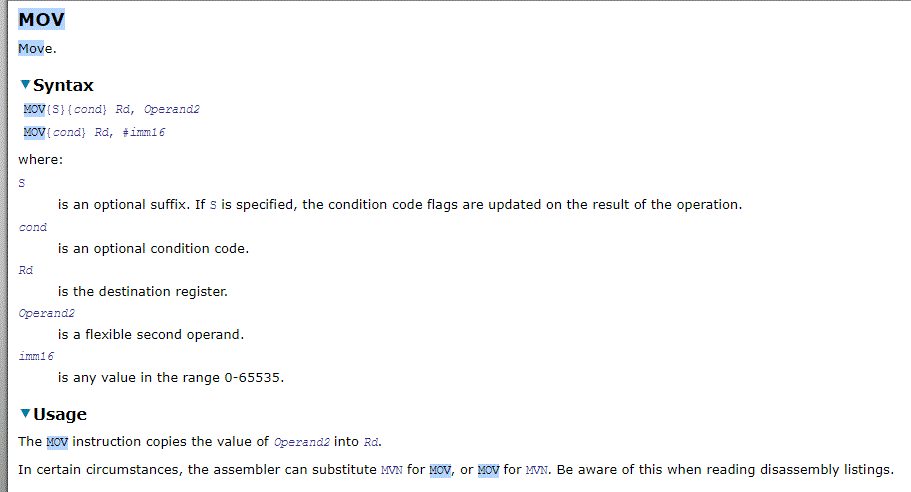

# Chapter 10 - Introduction to ARM and Assembly

This chapter discusses how to write and run a small assembly program for ARM. 

## Chapter Topics:
* ARM basics
* Writing an assembly source program
* Assembling and loading a program
* Running a program
* Exploring a small program


## 10.1 - Big Picture 
Computers do a pretty small number of things over and over again: 
* move values from memory to CPU and vice versa
* perform arithmetic & logical operations (add, compare, etc)
* read from memory and write to memory

Every CPU implements a "small" set of basic instructions that describe the set of operations it can perform.

These basic instructions are the machine language or **instruction set architecture (ISA)** of the computer.
An ISA describes what the CPU can do and doesn't specify HOW those capabilities are implemented.  Think of ISAs as an API to the hardware.

The advantages of this are:
* hides complexity of HW details
* allows for backwards compatibility of multiple generations of a particular chipset
* allows manufacturers to keep the same ISA interface, but change the internal HW specifics for performance, new technologies, etc.

Recall that programs written in a high-level language are ultimately converted into machine language instructions to execute on the CPU. Different languages do this differently: Java's process is different than C's is different than python's.

Your Raspberry Pi has ARM chip in it.  ARM the dominates mobile & small device market.  Another major player is Intel and their x86 chips/ISA.

Our goals for this chapter:
* understand how programs execute at machine level
* build a mental model of how programs and system interact
* translate high-level statements into assembly

### Question (Review)
<details>
    <summary>
  What is a register?
    </summary>
A register is a part of the processor that holds a bit pattern. Processors have many registers.
</details>

## 10.2 - Specifics

The ARM has 16 32-bit registers.  They are named `r0`, `r1`, and so on up to `r15`

* `r0-r12` are **general purpose registers**, often referred to as GPRs.  This means that they are freely available for programmers to use in any manner they want.  The other registers have special purposes and should not be used willy-nilly by programmers. 
* `r13` is the **stack pointer** and stores the address of the top of the stack.  
* `r14` is the **link register** and is used during subroutine calls.  
* `r15` is the **program counter (PC)** which stores the address of the next instruction the CPU needs to fetch, decode, and then execute.

`r13-15` can be used by programmers; there's no hardware restriction on them.  However, they are **special purpose registers** or SPRs.  There are certain times and situations where programmers should read or write to these registers, but programmers must be extremely careful to use these registers in their intended manner or there may be unexpected consequences.


ARM is a **load-store architecture**.  This means that you must first load data into registers from memory, do operations on registers, save results back to memory.  You cannot, for example, add the bit patterns in two memory locations and then store the resulting pattern into memory.  Rather, you must break down that operation as in the following psuedocode:

```
load the 32 bits beginning at address A into register 1
load the 32 bits beginning at address B into register 2
add register 1 and register 2 and put the results in register 3
store the pattern in register 3 to address C
```

The practical consequence of this is that only load and store instructions can access memory.  Other instructions can only access registers.

## 10.3 - Writing an Assembly Program
Now you're ready to assemble and load a program.

A **source file** (in assembly language or in any programming language) is the text file containing programming language statements created (usually) by a human programmer. Any text editor will work. On Linux, the easiest text editor to use is `nano`.  If you become experienced in Linux, you will probably want to graduate to a better editor (I suggest `emacs` or `vim`, but as a common ground I'll use `nano`.

### Question (Review)
<details>
    <summary>
  (Review) What type of files does nano create?
    </summary>
	Text files — files of bytes that can be interpreted as ASCII characters.
</details>

## 10.4 - Two Plus Three
Word processors usually create "binary" files and so are not suitable for creating source files. They can be forced to output a text file, but a real programming editor is much nicer. With your program (text) editor create a file called `addup.s`.  By convention, ARM assembly files have a `.s` extension.

```
// Adding two numbers

.global main

main:
    push {ip, lr}

    // Load immediate values into r0 and r1
    mov r0, #2
    mov r1, #3

    // r0 <- r0 + r1
    // dest reg <- src reg 1 + src reg 2
    add r0, r0, r1

    // Return
    pop {ip, pc}
```
The first thing you may notice is that we're using C-style comments: `//` and `/* ... */`.  Comments in ARM work the same way as they do any other programming language.  Anything that comes after `//` is ignored until the newline character.  Likewise, multi-line comments surrounded by `/*` and `*/` are ignored.

Each of the 5 non-comment lines after `main:` correspond to a single machine instruction.

### Question (Review)
<details>
    <summary>
  What is a machine instruction?
    </summary>
	A machine instruction is a pattern of bits that asks for one machine operation to be executed.
</details>

## 10.5 - Assembling the Source File
We can use `gcc` to assemble our ARM source code files.  How convenient!  In reality, `gcc` is a collection of many different compilers.  (Fun fact: `gcc` stands for GNU Compiler Collection.)

```
$prompt gcc -o addup addup.s
```

You must fix any errors before you can run your program.  Some of the options to `gcc` remain the same: the `-o` command line flag specifies the name of the executable produced.  In this case, it's `addup`.  

We can then run the executable:

```
$prompt> ./addup
```

When the program ends, you will see your prompt again.

### Question 
<details>
    <summary>
 	What happens when a program ends?
    </summary>
	Control is returned to the operating system.  In a terminal environment, the best visual indicator we have is the presence of our `$prompt>` again.
</details>

## 10.6 - Explanation of the Program
There are various ways for a program executing on a real machine to return control to the operating system. But we have no OS, so for now we will single step instructions. Hopefully you are wondering how the program works. Here it is again:

```
// Adding two numbers

.global main

main:
    push {ip, lr}

    mov r0, #2
    mov r1, #3
    add r0, r0, r1

    pop {ip, pc}
```

The first line of the program is a comment. It is ignored by the assembler and results in no machine instructions.

.global main is a directive. A **directive** is a statement that tells the assembler something about what the programmer wants, but does not itself result in any machine instructions. This directive tells the assembler that the identifier `main` will be used outside of this source file (that is, used "globally") as the label of a particular location in main memory.  We will some some other directives when we work with variables. Blank lines are ignored. 

The line `main:` defines a **symbolic address** (often called a **statement label**). A symbolic address is a symbol (an identifier) that is the source code name for a location in memory. In this program, `main` stands for the address of the first machine instruction. Using a symbolic address is much easier than using a numerical address. With a symbolic address, the programmer refers to memory locations by name and lets the assembler figure out the numerical address.

The symbol `main` is global. This means that several source files can use the symbol `main` to refer to the same location in storage. (However, all our programs will be contained in a single source file.)

The next line is `push {ip, lr}`.  For now, this statement is magic.  It has to do with beginning a new function, and we'll learn more about its usage when we write simple functions.

The next line: `mov r0, #2` translates into a 32-bit machine instruction. The machine instruction, upon execution, puts a 32-bit two's complement format positive two into register zero.  We then see this same idea repeated with the next instruction, `mov r1, #3`.  Both of these instructions use **immediate addressing**.  The `#2` portion of the instruction means that we are using the literal value two, and the 32-bit pattern loaded into `r0` would be `0000 0000 0000 0000 0000 0000 0000 0010`.  

How do we know that the instruction should be `mov r0, #2` and not `mov #2, r0`?  Well, if we were to read the ISA we would see something like this:



This is complex, but the takeaway is that the instruction takes the form

```
mov Rd, #imm
```

`Rd` stands for the **destination register** and signifies where the result of the operation ends up, and you will see that the instruction simply copies the second operand (in this case, the immediate/literal value) to the specified destination register.

The next instruction is `add r0, r0, r1`.  This instruction takes the values in `r0` and `r1`, adds them together, and puts the result back into `r0`.  This instruction has the form `add Rd, Rs1, Rs2`.  You will notice that having the destination register come first, before the operands, is the common ARM pattern.

The last statement, `pop {ip, lr}`, is more magic for now.  However, it has to do with returning from a function, and we'll cover it in-depth later.

Phew!  And we're done!

## 10.7 Equivalent C program
Here is a C program which is (roughly) equivalent to the assembly program we just wrote:

```
int main(void) {
	return 2 + 3;
}
```

Being the observant student you are, you might compare the assembly program and the C program and ask, "What about the return statement?  Where is that in the assembly program?"

Believe it or not, the return statement is built into the structure of our assembly program.  When any function ends (including `main`), the value in `r0` is the return value.  This is a **convention** established by programmers and the ARM chip architects.  Our assembly program uses the `add` instruction to place the calculated value of `2+3` into `r0`.  Then when the computer executes the `pop` instruction and ends the execution of `main`, the correct value is returned to the operating system.  You can see the value returned by a program (any program, not just our `addup` program) in Linux by issuing the command:

```
$prompt> echo $?
```

So if you run the following 3 commands in sequence, assuming you have no errors, you would see the value 5 displayed on your terminal, like so:
```
$prompt> gcc -o addup addup.s
$prompt> ./addup
$prompt> echo $?
5
$prompt>
```

## 10.8 Other ARM instructions
There are several other basic instructions which we will use extensively in our assembly programming

| Instruction Format | Purpose | Notes |
|--------------------| --------|--------|
|`mov Rd, #imm`      | moves a literal value into a register | |
|`add Rd, Rs1, Rs2   | adds the two binary patterns in two registers and places result in a register | uses binary addition |


