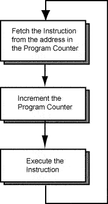

# Branching and Conditional Branching

The power of computers is their ability to repeat actions and their ability to alter their operation depending on data. Modern programming languages express these abilities using control structures. Repeated action (iteration) is done with a while structure. Alternative control paths (alternation) is done with an if-then-else structure.

The machine instructions of the processor do not have these structures, nor does assembly language. When you program in assembly language you must build these structures out of basic assembly instructions. These basic instructions are the `branch` instruction and the conditional branch instructions.

## How a Branch Works
Most modern computers work on what we refer to as the **Fetch-Decode-Execute** cycle.  These three steps: fetching, decoding, and executing instructions happen over and over again.

When a program is executing, its instructions are located in main memory. The address of an instruction is the address of the first byte of the four-byte instruction.

Each machine cycle executes one machine instruction. At the top of the machine cycle, the PC (program counter) contains the address of an instruction to fetch from memory.  On an ARM chip, the PC is stored in the special purpose register R15.  The instruction is fetched into the processor and is prepared for execution.



In the middle of the machine cycle the PC is incremented by four so that it points to the instruction that follows the one just fetched. Then the fetched instruction is executed and the cycle repeats. The machine cycle automatically executes instructions in sequence.

When a `b` (branch) instruction executes (in the last step of the machine cycle), it puts a new address into the PC. Now the fetch at the top of the next machine cycle fetches the instruction at that new address. Instead of executing the instruction that follows the branch instruction in memory, the processor "branches" (or jumps) to an instruction somewhere else in memory.

## Symbolic Addresses
How does the processor know what address to load into the PC when a branch instruction executes?  Remember the concept of **labels* which are just symbolic names for addresses.  For example, we've seen the label `main` in our programs:

```
main: 
  push{ip, lr}
  ...
  pop{ip, pc}
```
`main` is used as just an alias to a specific address in our address space.  So the ARM assembly instruction:
```
b main
```
would cause the address of the first instruction in the function `main` to be loaded into the PC.  On the next machine cycle, the processor would fetch that instruction and the flow of execution would proceed from there.

## Neverending Loops

Consider the following portion of an ARM program:

```
...

.data
x .word 0

.text
...
loopstart:
  ldr r2, =x
  ldr r1, [r2]
  add r0, r1, #1
  str r0, [r2]
  b loopstart
```

In this program, the instruction `b loopstart` causes the flow of instruction to change.  The address of the instruction `ldr r2, =x` is loaded into the PC and begins the execution.  In fact, you're probably thinking that this looks a lot like a loop.  It is!  But it's a *never-ending* loop.  The above assembly program is (roughly) equivalent to the following C program:

```
while(true) {
  x = x + 1;
}
```
We have written an infinite loop!  We load x's value from memory, increment that value by 1, and return it to memory over and over and over and over...

So we see that just a simple branch instruction isn't sufficienbt to allow us to write loops and if-then-else control statements.  To do that, we need **conditional branching** instructions.

## ARM Status Register
In order to learn about conditional branching instructions, we have to first discuss the **Application Program Status Register** or **APSR**.  This register stores condition flags that track the results of comparison operations.  The bits in the register are turned on (set to 1) and off (set to 0) to indicate different properties of instructions or their results as they execute.  

In this class, we are concerned with 5 specific bits in this register.  For ease of use, we assign letters to these bits which help us remember their purpose.  The 5 bits are:

* N: negative bit - set if the result of an instruction is negative
* Z: zero bit - set if the result of an instruction was zero
* C: carry bit - set if the result of the instruction generated a carry or borrow
* V: overflow bit - set if the result of the instruction generated an overflow

## Conditional Branching Instructions
A conditional branch instruction branches to a new address only if a certain condition is true. Usually the condition is about the values in two registers. 

We use the `cmp` instruction to compare the values in two registers.  The `cmp` instruction then sets bits in the APSR based on the comparison of the two values from the registers.  However, it is important to note that the `cmp` instruction does not change the values in the two registers it compares.

The `cmp` instruction can then be followed by a conditional branching instruction.  There are 6 conditional branching instructions, but we'll begin with the easiest: `beq` or branch on equal.  

The following snippet demonstrates how to use the `cmp` followed by a `beq` instruction:
```
cmp r1, r2
beq  label   
```
The bit patterns in two registers `r1` and `r2` are compared. Based on the comparison, one or more of the 4 bits discussed above in the ASPR are updated.  The `beq` instruction then checks the ASPR to see the values were the same.  If they were, the PC is changed to the branch address corresponding with `label`.

## Programming Using Labels
Now that we have conditional branches, we can discuss a simple strategy for implementing if statements using `cmp` and a conditonal branching instruction. When translating from a high level language, use the `cmp` instruction to compare the the values on each side of a relational operator.  Then branch on the **opposite condition**.

For example, suppose we want to translate the high level if statement `if(x != 4)` into assembly.

First, we use our `ldr` instructions to load the value of x from memory:
```
ldr r0, =x      // r0 now contains x's address
ldr r0, [r0]    // r0 now contains x's value
```

Then we compare x's value (contained in `r0`) to the literal value 4:
```
cmp r0, #4
```

Last, we branch on the opposite condition.  In other words, the high level language statement specifies `x != 4`.  We will branch using `beq` which is the opposite of not equal.
```
beq label
```

Why do we branch on the opposite condition?  This is because ARM accomplishes the comparison by calculating the difference between the two values being compared.  In other words, it subtracts. If r0 is greater than 4, the negative bit (N bit) in the APSR be set to 0.  If r0 is less than 4, the result will be negative and the N bit will be set to 1.  If r0 is 4, the result will be zero and the zero bit (Z bit) in the APSR will be set to 1.  Then our `beq` statement will execute.  


## A Complete Example
Let's take a look at a complete example using the new instructions.  Suppose we want to implement the logic for a simple if statement in C, like the following logic:

```
int main() {
  int x = -15;
  if (x != 0) {
    x++;
  }
  return x;
}
```

We need to add a label to our program which enables us to "skip" the body of the if statement (that is, the `x++;` statement) if our condition is false.


```
.global main


/*** Data section ***/
.data

x: .word -15


/*** Text section ***/
.text

main:
    push {ip, lr}

    ldr r0, =x
    ldr r0, [r0]

    // Compare instruction performs subtraction and
    // sets condition codes, but doesn't change
    // register values
    cmp r0, #0  // check x - 0

    // Branch if the result of the previous
    // comparison was EQUAL to 0
    //
    // That is if x == 0, jump AROUND the body of the
    // if statement and skip adding 1 to x
    beq done

    // Body of if, excecutes if x == 0
    add r0, r0, #1

done:
    pop {ip, pc}
```

Notice how we used the label `done` to bypass specific assembly instructions.

## More Branching Instructions
There are more conditional branching instructions, but using the general problem strategy above will help you translate code to asssembly in a systematic way.  Below are other conditional branching instructions and what bits in the APSR they are based on.  In practice, you don't need to work with the individual APSR bits.  The mnemonics of the assembly instructions mask this complexity and provide an easier way to think about our logic.

| Instruction | Meaning | APSR bits |
|-------------|---------|-----------|
| `beq` | branch on equal | Z bit is 1 |
| `bne` | branch on not equal | Z bit is 0 |
| `blt` | branch on less than | N bit is not the same as the V bit |
| `bgt` | branch on greather than | Z bit is 0 and N bit is the same as the V bit|
| `ble` | branch on less than or equal to | Z bit is 1 and N bit is not the same as the V bit |
| `bge` | branch on greather than or equal to | N bit is the same as the V bit |

## Key Points
There are some important things to remember while working with branching structures in ARM assembly:
* `cmp` DOES NOT change the values in registers.  The result of the comparison subtraction is not stored.
* Other instructions can change bits in the APSR.  `cmp` should always be followed immediately by a branching instruction
* A common mistake is reversing the order of values in a compare instructions.  `cmp r1, r0` and `cmp r0, r1` will usually cause very different bits to be set in the APSR.


