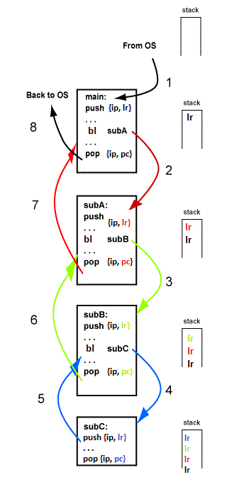

# Chapter 14: Subroutines in ARM Assembly

All high level languages have the concept of a **subroutine** (sometimes called procedure, function, or method). A subroutine is a logical division of the code that may be regarded as a self-contained operation. For example, the `power` function is usually implemented as a subroutine.

This chapter looks at a simple implementation in assembly language of this idea. The simple implementation is not adequate for the full power of subroutines (as implemented in high level languages), but is a good starting point. It corresponds to the type of subroutines implemented in the early days of programming.

Chapter Topics:
* Subroutine call
* Caller and Callee routines
* `bl` instruction
* The $ra register
* The simple linkage calling convention
* Register use in subroutines

## 14.1 - Passing Control with a Branch Instruction
Below is a sketch of what you can do with the `b` instruction. If the main routine needs to start up ("to call") a subroutine named `sub` it can jump to it with a `b` instruction. At the end of the subroutine, control can be returned with another `b` instruction.

The subroutine returns to a statement in `main` labeled `ret`. The subroutine is called at just one point in `main` and it returns to an address a few instructions after that point.

The subroutine is only used once in the main program because it always returns to the same location. (You could write some tricky code to overcome this limitation. But it is much better to follow a subroutine linkage convention such as is about to be discussed.)

A subroutine call is when a routine (`main` in this example) passes control to a subroutine. The `main` routine is said to be the **CALLER** and the subroutine is said to be the **CALLEE**. A return from a subroutine is when a subroutine passes control back to its CALLER. When a CALLEE finishes execution it nearly always returns control to its CALLER.

## Problems with Branch Instruction and Subroutine Calls
The problem is illustrated at right. The `main` routine is written to call a useful subroutine `sub` at several locations in the code. But, as it is written, `sub` always returns control to the same location.  This will result in an infinte program which does not make forward progress.

In the past, before the concept was completely understood, hardware support for subroutines was missing. Various nasty software tricks were used to implement the idea.

What is needed is a way to send a **return address** to the subroutine when it is called. Now when the subroutine finishes, it loads the PC (program counter) with the return address. The next instruction fetch of the machine cycle will get the instruction from that address.

## The `bl` Instruction
The register that is used for linkage is register `r14`, which is called `lr` by the extended assembler. It holds the return address for a subroutine. The instruction that puts the return address into `lr` is the `bl` instruction.

Register `r14` is one of the three "general purpose registers" that behave differently from the others. (The others are `r13`, the stack pointer, and `r15`, the PC.) The `bl` instruction and register `lr` provide the hardware support necessary to elegantly implement subroutines.

To understand how `bl` works, review the machine cycle. The ARM endlessly cycles through three basic steps. Each cycle executes one machine instruction. (This is a somewhat simplified view, but sufficient for now).

The `bl` instruction does the following in the execute phase of the machine cycle:

```
bl sub     // lr <― PC  (the address of the instruction after bl) 
           // PC  <― sub   load the PC with the address of the first instruction of subroutine (called the entry point)

```

## Calling Conventions and Register Use
A **calling convention** is an agreement about how subroutines are called and how control is returned to the caller. Mostly (as we will later see) this is an agreement about how software will work. In processors (like ARM) that have hardware features that support subroutines, the convention says how those features are used.

Question: is the subroutine `sub` free to use any of our general purpose registers any way it wants?

To answer the question, you could look at the code for `main` to determine which registers contain information and so can not be altered by `sub`. Do this every place in `main` that `sub` is called, because different registers are likely to be in use at different places. Now write `sub` using only those registers that are not in use before any call.

This is tedious and error prone. Worse, if you make a change to `main` , you now might have to re-code `sub` using different registers.

One of the goals in writing a subroutine is to create a module that is independent of the rest of the code. We have not achieved that, yet.

Another issue is how data is passed into and out of the subroutine. Often data (arguments) is in registers, and the result (return value) is in a register. Which registers?

By software convention (not by hardware) registers have been assigned different roles:

`$r0 - $r3` — These registers are used for arguments to the subroutine, and the subroutine is free to change these registers.
`$r4 - $r12` — The subroutine must not change these registers.
`$r0` — This register contains the return value from the subroutine.

## A Simple Program
Below is a simple first program.  In this program, `main` calls a simple function `alwaysthree` which simply returns 3.

```
// Calling a function using bl

.global main


/*** Text section ***/
.text

// A function is identified by a label
// This function returns 3
returnThree:
    push {ip, lr}

    mov r0, #3

    pop {ip, pc}


main:
    push {ip, lr}

    // Call the function
    bl returnThree

    // Return
    pop {ip, pc} 
```
You probably have some questions after looking at this program.  The biggest is probably, "Where's the return statement?"  That's an astute question, as no such instruction exists in assembly langauge.  Instead, we have to turn our attention to the "push-pop sandwich" that surrounds each subroutine.

## Stack-based Subroutine Calls
To return to the caller a subroutine must have the correct return address in `lr` when the `bl` instruction is performed. But this address does not have to remain in `lr` all the time the subroutine is running. It works fine to save the value in `lr` stored somewhere temporarily. The value can be restored, later on, when it is time to return to the caller.


In the picture, the operating system calls `main`. The return address to the operating system is in `lr`. As soon as it gets control, `main` pushes the return address onto the stack (step 1). The return address that `main` should use when it returns to the operating system is now on the top of the stack.

The `push` and `pop` instructions in the picture are psuedo-instructions which handle several things for us.  Specifically, they not only copy data to the stack, but they also manipulated the stack pointer, stored in `r13`, for us so that it remains as a reference to the top of the stack.

After pushing the return address, `main` computes for a bit, and then calls `subC` using a `bl` instruction (step 2). This puts the return address to main in `lr`. Luckily, it does not matter that `lr` has been changed because the return address that main will use to return to the operating system is safely stored on the stack.

`subC` receives control and computes for a while. Because it does not call another subroutine, `subC` does not alter `lr` and does not need to save it on the stack. When `subC` returns to main it uses a `pop` instruction (step 3) to place the stored return address into the PC.  This means that the instruction at the return address will be the next instruction to execute.

Control returns to `main`, which computes for a while longer. It returns to the OS by popping the stack into `pc`.  This last address of instruction indicates to the OS that our program has finished (step 4).

## Subroutines Calling Subroutines
Now let us look at an example where subroutines call other subroutines. A subroutine that might call another subroutine must push the return address it gets onto the stack. When it returns to its caller, it pops the stack to get the return address.



In the picture, `main` is called by the OS. As soon as `main` gets control it pushes `lr` onto the stack (step 1). `main` computes for a while and then calls `subA`. `subA` immediately pushes the contents of `lr` onto the stack (step 2). The return address that `subA` will use when it returns control to `main` is now on the top of the stack.

Next `subA` calls `subB` which pushes the contents of `lr` onto the stack (step 3). The return address that `subB` should use when it returns to its caller is now on the top of the stack.

Now `subB` calls `subC` (step 4). `subC` does not call any subroutine so `lr` does not technically have to be saved.  However, it's easiest to simply always sandwich the subroutine calls in `push` and `pop` so that we can modify it in the future. `subC` computes for a while, and then returns to its caller using `pop` (step 5).

Now `subB` has control again. The return address it needs to use is at the top of the stack. `subB` returns to its caller by popping the stack into `pc` (step 6).

Now `subA` has control again. The return address it needs to use is at the top of the stack. `subA` returns to its caller by popping the stack into `pc` (step 7).

Finally, `main` has control. After a computing for a while it returns to the OS by popping the stack into `pc` (step 8).

## Register Problems
In calling conventions previously, we stated that registers `r4-r12` must not be altered by a subroutine. But this restriction creates a problem when subroutines call other subroutines.

Say that `main` calls `subA` and that `subA` calls `subB`. `subA` can't save any values in `r4-r12` (because it is not allowed to alter them). But any values it saves in `r0-r4` might be clobbered by `subB` (because `subB` is allowed to alter them). In effect, `subA` can't use any registers! Not good.

The solution is to allow `subA` to use `r4-r12`. However, before using one of these registers, `subA` must save its value on the stack. Later, when `subA` returns to its caller, it must restore the register to its initial state.

Question: is it safe to store `r4-r12` AND `lr` on the stack?
Answer: Yes, but we must be careful to synchronize the calls to push and pop so that the correct values go into the correct registers.

## Pushing and Popping Registers
Here is a rule: if a subroutine is expected to alter any of registers `r4-r12`, it must first push their values onto the stack. Just before returning to the caller it must pop these values from the stack back into the registers they came from.

We can do this easily by adding to the "push-pop" sandwich which already surrounds our subroutine calls.

```
sub: 
  push {ip, lr}   
  push {r4-r12}
  ...
  // function uses r4-r12 as needed
  pop {r4-r12}
  pop {ip, pc}
```

## Summary
To sum up a stack based subroutine calling protocol:

1. Subroutine Call (done by the caller):
  a. Push onto the stack any registers `r0-r3` that contain values that must be saved. The subroutine might change these registers.
  b. Put argument values into `r0-r3`.
  c. Call the subroutine using `bl`.
2. Subroutine Prolog (done by the subroutine at its beginning):
  a. push `lr` onto the stack.
  b. Push any registers `r4-r12` that this subroutine might alter.
3. Subroutine Body:
  a. The subroutine may alter any register, `r0-r3` and and register `r4-r12` that it saved in the prolog (step 2b).
  b. If the subroutine calls another subroutine, then it does so by following these rules.
4. Subroutine Epilog (done by the subroutine just before it returns to the caller):
  a. Put returned value in `r0`
  b. Pop from the stack (in reverse order) any registers `r4-r12` that were pushed in the prolog (step 2b).
  c. pop the return address from the stack into `pc`.
5. Regaining Control from a subroutine (done by the caller):
  a. Pop from the stack (in reverse order) any registers `r0-r3` that were previously pushed (step 1a).
