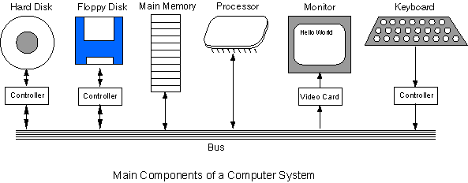
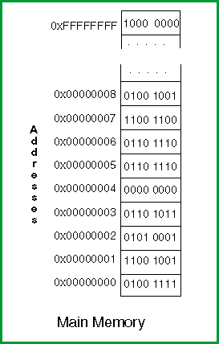
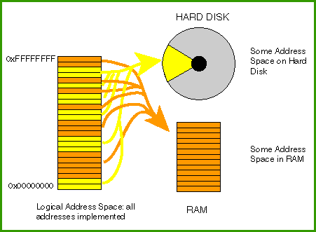

# Chapter 4 — Computer Systems
This chapter discusses how computer systems are organized, with special attention paid to main memory. You may know some of this material already, but look it over anyway.

## Chapter Topics:

* Components of a Computer System
* Device Controllers
* Main Memory
* Addresses
* Virtual Memory
* Cache Memory
* Contents of Memory

### Question

    

      Does a computer system based upon one type of processor chip (say ARM) look about the same as a system based upon another type of chip (say Pentium)?
    

    Yes. The main components are about the same and work about the same way.

## 4.1 - Computer System Components
The diagram shows a general view of how desktop and workstation computers are organized. Different systems have different details, but in general all computers consist of components (processor, memory, controllers, video) connected together with a bus. Physically, a **bus** consists of many parallel wires, usually printed (in copper) on the main circuit board of the computer. Data signals, clock signals, and control signals are sent on the bus back and forth between components. A particular type of bus follows a carefully written standard that describes the signals that are carried on the wires and what the signals mean. The PCI standard (for example) describes the PCI bus used on most current PCs.

The processor continuously executes the machine cycle, executing machine instructions one by one. Most instructions are for an arithmetical, a logical, or a control operation. A machine operation often involves access to main storage or involves an i/o controller. If so, the machine operation puts data and control signals on the bus, and (may) wait for data and control signals to return. Some machine operations take place entirely inside the processor (the bus is not involved). These operations are very fast.

### Question

    

    Do you think that the various components can put signals and data on the bus at any arbitrary time?
    

    No. The various devices must cooperate somehow so their data and signals don't get mixed.

## 4.2 - Input/output Controllers
The way in which devices connected to a bus cooperate is another part of a bus standard.

**Input/output controllers** receive input and output requests from the central processor, and then send device-specific control signals to the device they control. They also manage the data flow to and from the device. This frees the central processor from involvement with the details of controlling each device. I/O controllers are needed only for those I/O devices that are part of the system.

Often the I/O controllers are part of the electronics on the main circuit board (the mother board) of the computer. Sometimes an uncommon device requires its own controller which must be plugged into a connector (an expansion slot) on the mother board.

I/O controllers are sometimes called **device controllers.** The software that directly interacts with a device controller is called a **device driver**. When you install a new device on your computer (say, a new graphics board) you must also install a device driver for it.

### Question (Review)

    

    Is there a difference between the memory used to hold programs and the memory used to hold data?     
    

    No. Potentially any byte of main memory can hold part of a program or part of some data.

## 4.3 - Main Memory

In practice, data and instructions are often placed in different sections of memory, but this is a matter of software organization, not a hardware requirement. Also, most computers have special sections of memory that permanently hold programs (firmware stored in ROM), and other sections that are permanently used for special purposes.

Main memory (also called main storage, or just memory) holds the bit patterns of machine instructions and the bit patterns of data. Memory chips and the electronics that controls them are concerned only with saving bit patterns and returning them when requested. No distinction is made between bit patterns that are intended as instructions and bit patterns that are intended as data. The amount of memory on a system is often described using the terms in the table below.

These days (Summer, 2019-ish) the amount of main memory in a new desktop computer ranges from about 4 gigabytes to 32 gigabytes. Hard disks and other secondary storage devices hold several terabytes.

For reference:
kilobyte:	210 = 1024 bytes
megabyte:	220 = 1024 kilobytes
gigabyte:	230 = 1024 megabytes
terabyte:	240 = 1024 gigabytes

### Question (Review)

    

    (On most computers,) what is the smallest addressable unit of memory? 
    

    A byte.

## 4.4 - Addresses
 cells of memory
Each byte of main storage has an **address**. 32-bit addresses are common (and that's what we'll use in this class) so there are 232 possible addresses. Think of main storage as if it were an array.

A main storage address is an index into memory. A 32-bit address is the address of a single byte. Thirty-two wires of the bus contain an address (there are many more bus wires for timing and control).

Sometimes people talk about addresses like 0x2000, which looks like a pattern of just 16 bits. But this is just an abbreviation for the full 32-bit address. The actual address is 0x00002000.

The first ARM processor (the ARMv1, delivered in 1985) used 26-bit addresses. Beginning with the ARMv6 (1991), ARM used 32-bit addresses. The ARMv8 (2011) supported full 64-bit addressing.  Other recent processor chips from AMD and Intel have 64-bit addresses (32-bit versions are still available although becoming much less frequent).

The assembly language of this course is for the Raspberry Pi 3/3+ which are built on QualComm's ARM Cortex-A53 chip (a variant of the ARMv8).  While this chip supports full 64-bit addressing, we won't be using it to its full capabilities.  We'll most often use 32-bit addresses for demonstration purposes in this course.

### Question (Review)

    

    What is the hexadecimal name for the 32-bit pattern that consists of all 1 bits? (Hint: look at the picture.)
    

    0xFFFFFFFF

## 4.5 - Virtual Memory

The MIPS has an address space of 232 bytes. A Gigabyte is 230, so the MIPS has 4 gigabytes of address space. Ideally, all of these memory locations would be implemented using memory chips (usually called RAM).

On modern computers, the full address space is present no matter how much RAM has been installed. This is done by keeping some parts of the full address space on disk and some parts in RAM. The RAM, the hard disk, some special electronics, and the operating system work together to provide the full 32 bit address space. To a user or an applications programmer it looks as if all 232 bytes of main memory are present.

This method of providing the full address space by using a combination of RAM memory and the hard disk is called virtual memory. The word virtual means "appearing to exist, but not really there." Some computer geeks have a virtual social life.

    

    Which is faster: access to physical (RAM) memory or access to the hard disk?
    

    Physical memory.

## 4.6 - Cache Memory
Disk access is slow compared to RAM access. Potentially, using a combination of real memory and disk memory to implement the address space could greatly slow down program execution. However, with clever electronics and a good operating system, virtual memory is only slightly slower than physical memory.

Computer systems also have cache memory. Cache memory is very fast RAM that is inside (or close to) the processor. It duplicates sections of main storage that are heavily used by the currently running programs. The processor does not have to use the system bus to get or store data in cache memory. Access to cache memory is much faster than to normal main memory.

Like virtual memory, cache memory is invisible to most programs. It is an electronic detail below the level of abstraction provided by assembly language. Hardware keeps cache up to date and in synch with main storage. Your programs are unaware that there is cache memory and virtual memory. They just see "main memory". Application programs don't contain instructions that say "store this in cache memory", or say "get this from virtual memory". They only refer to the contents of main memory at a particular address. The hardware makes sure that the program gets or stores the correct byte, no matter where it really is.  You'll learn more about operating systems software in future classes.

    

        Since memory looks like an array of bytes, is it necessary for each item of data in memory to be one byte long?
    

    No. Most data and instructions are several bytes long and occupy several consecutive memory addresses.

## 4.7 - Contents of Memory
The memory system merely stores bit patterns. The electronics don't care whether these patterns represent integers, characters, instructions, or something else entirely.  How these patterns are used depends on the programs that use them. A word processor program, for example, is written to process patterns as characters. A spreadsheet program processes patterns as numbers.

Of course, most programs process several types of data and must keep track of how each is used. Often programs keep the various uses of memory in separate sections, but that is a programming convention rather than a requirement of electronics.

Any byte in main storage can contain any 8-bit pattern. No byte of main storage can contain anything but an 8-bit pattern. There is nothing in the memory system of a computer that says what a pattern represents.

QUESTION 8:

    

        When first turned on, many computer systems test their RAM for a hardware failure by writing various patterns to various locations and then reading the patterns back. Do you think this is a good test?
    

        It is a good test. The job of memory is to hold bit patterns and to return them when requested, and so this test will ensure that functionality.

