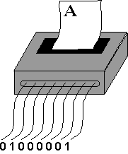

# Chapter 5 - Representing Characters with Bit Patterns

Patterns of bits represent many types of things. This chapter shows how bit patterns are used to represent characters.

## Chapter Topics:
* ASCII
* Control characters
* Teletype Machines
* .asciiz and null terminated strings
* Disk files
* Text files
* Binary files
* Executable files

### Question
<details>
    <summary>
      What else (besides characters and integers) can be represented with bit patterns?
    </summary>
    Machine instructions. (Many others answers are correct too; anything symbolic can be represented with bit patterns: graphics, music, floating point numbers, internet locations, video, ...)
</details>

## 5.1 - Representing Characters

A group of 8 bits is a byte. Typically one character is represented with one byte. The agreement by the American Standards Committee on what pattern represents what character is called ASCII. (There are several ways to pronounce "ASCII". Frequently it is pronounced "ásk-ee"). Most microcomputers and many mainframes follow this standard.



When a printer built to print ASCII receives the ASCII pattern for "A" (along with some control signals), it prints an "A". Printers built to other specifications (typically for mainframe computers) might print some completely different character if sent the same pattern.

Most modern printers are much more complicated than the one illustrated above. Typically, a modern printer is sent an entire file of information at once. The file describes the layout and contents of an entire page. ASCII characters are just some of the information in the file.

### Question
<details>
    <summary>
      Do some files contain bit patterns that represent things other than characters?
    </summary>
      Of course.  Files composed of nothing but text are rare these days, but source code files (such as `Hello.java` or `hello.c`) are a notable exception and are plain text files.
</details>

## 5.2 - Control Characters
Some ASCII patterns do not correspond to a printable character. For example, the pattern 0x00 (ie. 0000 0000) is the NUL character. NUL is often used as a marker in collections of data. The pattern 0x0A is the linefeed character (LF), sent to a printer to indicate that it should advance one line. The patterns 0x00 through 0x1F are called **control characters** and are used to control input and output devices. The exact use of a control character depends on the particular output device. Many control characters were originally used to control the mechanical functions of a Teletype machine.

### Question
<details>
    <summary>
      Could a computer terminal be a *mechanical* device???
    </summary>
      Yes. The better ones smelled of fresh machine oil and chattered pleasantly as they worked.
</details>

## 5.3 - Teletype Machines
Teletype machines were used from 1910 until about 1980 to send and receive characters over telegraph lines. They were made of electrical and mechanical parts. They printed characters on a roll of paper. Various mechanical actions of the machine were requested from a distance by sending control characters over the line. A common control sequence was "carriage return" followed by "linefeed".


In the early days of small computers (1972-1982) Teletypes were often the sole means of input and output to the computer. These Teletype machines printed with fixed-size characters (like their electric typewriter cousins). 

```
Code is still often presented in fixed-size type in computer science 
textbooks and classrooms.  This paragraph is set using a fixed-size 
type.  The tag used in HTML for fixed-size (non-proportional) font
used to be <tt> -- which stands for "TeleType". Sadly, the <tt> tag 
has been deprecated and is no longer used.
```

Some models of Teletypes could be used off-line (not connected to anything). The user could slowly and carefully type a message (or program) and have it recorded as holes punched on a paper tape. The device to the left of the machine in the photo above is the paper tape reader/puncher. Once the paper tape was correct, the Teletype was put on-line and the paper tape was quickly read in. In those days, paper tape was mass storage.

The web sites of the [North American Communications Museum](http://www.nadcomm.com/) has more information on Teletypes.

### Question
<details>
    <summary>
      Can the bit patterns that are used to represent characters represent other things in other contexts?
    </summary>
      Yes.
</details>

## 5.3 - ASCII Chart
| Hex  Char	| Hex   Char	| Hex   Char |	Hex    Char |
|------------|-----------|-----------|--------------|
| 00   nul	| 20   sp	| 40   @	| 60   \` |
| 01   soh	| 21   !	| 41   A	| 61   a |
| 02   stx	| 22   "	| 42   B	| 62   b |
| . . . | .	. . | . .	. | . . . |
| 0A   lf	| 2A   *	| 4A   J	| 6A   j |
| . . .	| . . . | . . .|	. . . |
| 1E   rs	| 3E   > |	5E   ^ |	7E   ~ |
| 1F   us |	3F   ?	| 5F   _	|7F   del |

The chart shows some patterns used in ASCII to represent characters. (See the appendix for a complete chart.) The first printable character is SP (space) and corresponds to the bit pattern 0010 0000.

Space is a character, just like any other. Although not visible in the shortened chart, the upper case alphabetical characters appear in order A,B,C, ..., X, Y, Z with no gaps. There is a gap between upper case and lower case letters. The lower-case characters also appear in order a,b,c,...x, y, z.

The last pattern is 0x7F which is 0111 1111. This is the DEL (delete) character. For a complete list of ASCII representations, see the appendix.

### Question
<details>
    <summary>
      How many of the total number of 8-bit patterns correspond to a character, (including control characters)? (Hint: look at the pattern for DEL).
    </summary>
      50 Percent, 128 out of 256
</details>

## 5.4 -  ASCII Sequences
The chart for ASCII shows all possible 7-bit patterns. There are twice as many 8-bit patterns. Some computer makers use the additional patterns to represent various things. Old MS Windows PCs, for example, used these extra patterns to represent symbols and graphics characters. Some printers will not work with these additional patterns.

Part of what an assembler does is to assemble the ASCII bit patterns that you have asked to be placed in memory. Here is a section of an assembly language program:
```
  .asciiz      "ABC abc"
```
Here are the bit patterns that the assembler will produce in the object module:
```
  41 42 43 20 61 62 63 00
```
The `.asciiz` part of the source code asked the assembler to assemble the characters between the quote marks into ASCII bit patterns. The first character, "A", corresponds to the bit pattern 0x41. The second character, "B", corresponds to the bit pattern 0x42. The fourth character, " " (space), corresponds to the bit pattern 0x20. The final bit pattern 0x00 (NUL) is used by the assembler to show the end of the string of characters.

### Question:
<details>
    <summary>
  What will be the assembled patterns for this assembly code:  
  .asciiz   "A B"
    </summary>
    (Answer in hex) 41 20 42 00
</details>

## 5.5 - Files
Files consist of blocks of bytes holding bit patterns. Pften the patterns are recorded on magnetic media such as hard disks. Although the actual physical arrangement varies, you can think of a file as a contiguous block of bytes. The `ls` command of Linux lists the number of bytes in each file (along with other information).

Ignoring implementation details (which vary from one operating system to the next), a file is a sequence of bytes on magnetic media or solid state drive. What can each byte contain? A byte on a magnetic disk can hold one of 2<sup>8<sup> (256) possible patterns, the same as a byte in main storage. Reading a byte from disk into a byte of main storage copies the pattern from one byte to another.

(Actually, for efficiency, disk reads and writes are always done in blocks of 128 bytes or more at a time).

So a file contains only bit patterns, as does main memory. What is represented by the bit patterns of a file depends on how they are used. For example, often a file contains bytes that represent characters according to the ASCII convention. Such a file is called a **text file**, or sometimes an ASCII file. What makes the file a text file is the knowledge about how the file was created and how it is to be used.

### Question
<details>
    <summary>
You (acting as an "English Language Application") find a battered old book in a stall outside a bookshop. You open the book to a random page and see:<br>
<pre>      Non sum qualis eram bonae sub regno Cynarae.
<pre>
Is this book suitable for you (in your role as an English application)?
    </summary>
    No. The individual letters are the same as used in your expected context (English) but in the book their context is different.
</details>

## 5.6 - Text Files
A computer application (a program) provides the context for the bit patterns of the input and output files it uses. Although there are some standard contexts (such as for text files), many applications use a context that is their own. If you could somehow inspect the surface of a disk and see the bit patterns stored in a particular file, you would not know what they represented without additional knowledge.

Often people talk of "text files" and "MS Word files" and "executable files" as if these were completely different things. But these are just sloppy, shorthand phrases. For example, when someone says "text file" they really mean:

**Text File**: A file containing a sequence of bytes. Each byte holds a bit pattern which represents a printable character or one of several control characters (using the ASCII encoding scheme). Not all control characters are allowed. The file can be used with a text editor and can be sent to a hardware device that expects ASCII character codes.

Files containing bytes that encode printable characters according to the ASCII convention have about half of the possible patterns. Software that expects text files can work with the ASCII patterns, but often can't deal with the other patterns.

### Question
<details>
    <summary>
      A file compressor is a program that inputs a file and outputs a smaller file that uses bit patterns more efficiently that in the original file. A decompressor restores the compressed file to the original version.

(Thought Question: ) When an ASCII file is compressed, does the resulting file contain ASCII characters?
    </summary>
    No. ASCII characters are wasteful of bits, since only seven of the eight bits are used. A compressed file makes better use of bit patterns. The bytes in the compressed file do not correspond directly to ASCII.
</details>

## 5.7 - Executable Files
When one says "executable file" one really means:

**Executable File**: A file containing a sequence of bytes. Each byte holds a bit pattern that represents part of a machine instruction for a particular processor. The operating system can load (copy) an executable file into main storage and can then execute the program.

A byte in an executable file can contain any possible 8-bit pattern. A file like this often is called a **binary file**. This is misleading vocabulary. All files represent their information as binary patterns. When one says "MS Word file" one really means:

**Word File**: A file containing a sequence of bytes holding bit patterns created by the MS Word program, which are understood only by that program (and a few others).

There is nothing special about the various "types" of files. Each is a sequence of bytes. Each byte holds a bit pattern. A byte can hold one of 256 possible patterns (although some file types allow only 128 or fewer of these patterns). When longer bit patterns are needed they are held in several contiguous bytes.

### Question: 
<details>
    <summary>
Say that you compress a text file with a file compression utility. What is the minimum compression can you expect?
    </summary>
  By using all the bits of a byte, a text file, at the minimum, could be compressed to 7/8 of its original size. In fact, compression utilities can do much better than this and typically compress a text file to 50% or less of its original size.
</details>

## 5.8 - Binary File
All files are sequences of bytes containing binary patterns (bit patterns). But people often say binary file when they mean:

**Binary File** (colloquial): a file in which a byte might contain any of the possible 256 patterns (in contrast to a text file in which a byte may only contain one of the 128 ASCII patterns, or fewer).

An EXE file is a binary file, as is a Word file, as is an Excel file, as are all files except text files. People are often not careful, and sometimes say "binary file" when they really mean "executable file". The phrase "binary file" became common among MS/DOS users because DOS file utilities made a distinction between text files and all others.

Using the wrong type of file with an application can cause chaos. Don't send an executable file to a printer, or open an MS Word file with a text editor. Some applications are written to deal with several types of files. MS Word can recognize text files and files from other word processors.

### Question: 
<details>
    <summary>
Why are word processor files not text files?
    </summary>
  Many types of data are represented in a word processor file, not just the characters of ASCII. A word processor file must also represent fonts, character sizes, formats, colors, graphics, etc. All these things are represented with bit patterns. Different word processors use different bit patterns to indicate these things.
</details>


