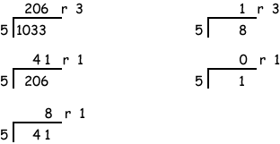

# Chapter 7 - Binary and Hex Integer Representation

Base 16 is often used to represent integers. Integers represented in base 16 are said to be represented with hexadecimal notation. The hexadecimal representation of an integer is equivalent to the pattern name of the bits in the binary representation of the integer.

It is easy to convert the representation of an integer between binary and hexadecimal. Converting representations between decimal and an arbitrary base is somewhat more difficult. The chapter presents some algorithms for doing this.

Chapter Topics:
* Left and right shifts
* Unsigned binary representation
* Familiar binary integers
* Hexadecimal representation
* Equivalence of hexadecimal representation and bit pattern names
* Converting representations from hexadecimal to binary
* Converting representations from decimal to any base

## 7.1 - Left Shift
Useful Fact: If the number N is represented by a bit pattern X, then X0 represents 2*N.

If 00110010<sub>2</sub> represents 50<sub>10</sub> , then 00110010**0** represents 100<sub>10</sub>. 

This is called "shifting left" by one bit. It is often used in hardware to multiply by two. Often you need the "shifted" pattern to have the same number of bits as the original pattern. Doing this with eight bits, 01100100 represents 100<sub>10</sub> (notice that we removed the leftmost 0 of the pattern).  If you must keep the same number of bits (as is usually true for computer hardware) then make sure that no "1" bits are lost on the left.

### Question
<details>
    <summary>
      With 8 bits, there are 2<sup>8</sup> patterns. What is the largest positive integer that can be represented in 8 bits using base two?
    </summary>
    2<sup>8</sup> - 1  =  256 - 1  =  255.<br> 
  There are 256 patterns possible with 8 bits. But when these patterns represent integers, one of the patterns (0000 0000) is used for zero.  You could also figure this out by noting that 11111111<sub>2</sub> is 255.
</details>

## 7.2 - Largest Positive Integer in N Bits
The representation scheme we are looking at is called unsigned binary because no negative numbers are represented. Often when people say "binary number" this is what they mean. Here are some of its characteristics:

1. With N bits, the integers 0, 1, 2, ... , 2<sup>N</sup> - 1 can be represented.
So, for instance, with 8 bits, the integers 0, 1, ..., 2<sup>8</sup> - 1 can be represented. These are the values 0 ... 255.

2. With N bits, zero is represented by 0....0....0 (all 0's).

3. (2<sup>N</sup> - 1) is represented by 1....1....1 (all 1's).

These facts are NOT always true for other representation schemes! Know what scheme is being used before you decide what a pattern represents.


### Question
<details>
    <summary>
Without doing any calculation, which of the following is the decimal equivalent of 1111 1111 1111?<br>
A. 2048<br>
B. 4095<br>
C. 16384<br>
D. 18432<br>
Look at fact 3 in the list and think a bit.<br>
<br>
Hint: Actually, you should think about a bit.<br>
    </summary>
4095<br><br>

A clever trick: perhaps you realized that the represented number is 2<sup>N</sup> - 1 which must be an odd number. ( 2<sup>N</sup> means 2 × 2 × 2 ... × 2 it must be even. So 2<sup>N</sup> - 1 must be odd. )<br><br>
So you picked the only odd number in the list. Or else you ignored the question.
</details>

## 7.3 - Base 16 Representation
Recall the Rules for Positional Notation:

1. The base B is (usually) a positive integer. 
2. There are B "digits" representing zero up to (B minus one). 
3. Positions correspond to integer powers of B, starting with power zero, and increasing right to left. 
4. The digit placed at a position shows how many times that power of B is included in the number. 

Rule 1 says any positive integer can be used as a base. Let's use sixteen as a base. Rule 2 says we need sixteen symbols to use as digits. The usual choices are the digits 0-9 and the letters A-F.

| Decimal | Hex Digit |
|----------|----------|
| 0 | 0 | 
| 1 | 1 |
| 2 | 2 |
| 3 | 3 |
| 4 | 4 |
| 5 | 5 |
| 6 | 6 |
| 7 | 7 |
| 8 | 8 |
| 9 | 9 |
| 10 | A |
| 11 | B |
| 12 | C |
| 13 | D |
| 14 | E |
| 15 | F |

Since there are only ten of the usual digits, letters are used for the remaining six hex "digits".

Base sixteen representation is called the **hexadecimal system**, or just **hex** for short.

### Question
<details>
    <summary>
        Fill in the blanks with BASE TEN digits:<br>
31A<sub>16</sub>  = ____ × sixteen<sup>2</sup> + ____ × sixteen<sup>1</sup> + ____ * sixteen<sup>0</sup>
    </summary>
    31A<sub>16</sub>  = 3 × sixteen<sup>2</sup> + 1 × sixteen<sup>1</sup> + 10 * sixteen<sup>0</sup>
</details>
    
## 7.4 - Converting a Hex Representation to Decimal
To convert a hexadecimal representation of an integer to base 10, write the integer as a sum of hex digits times the power of 16 that corresponds to each digit's position. Then, write the digits and the powers of 16 in base ten, and do the arithmetic.

31A<sub>16</sub> = 3 × sixteen<sup>2</sup> + 1 × sixteen<sup>1</sup> + A × sixteen<sup>0</sup>

                   = 3 × 16<sup>2<sup> + 1 × 16<sup>1<sup> +  10 × 16<sup>0</sup>

                   = 3 × 256 + 1 × 16 +  10 × 1  =  79410<sub>10<sub>
                   
You don't have to remember powers of 16 to do this conversion. All you need is powers of 2. For example, 16<sup>2</sup>  =  2<sup>4</sup> × 2<sup>4</sup>  =  2<sup>8</sup>  =  256.

As another example:   16<sup>3</sup>  =  2<sup>4</sup> × 2<sup>4</sup> × 2<sup>4</sup>  =  2<sup>12</sup>  =  2<sup>2</sup> × 2<sup>10</sup>  =  4K

### Question
<details>
    <summary>
        What integer is represented by 1B2<sub>16</sub>?
    </summary>
    434<sub>10</sub>
</details>

## 7.5 - Shifting by one Place
You already know how in base ten to multiply a number by 10: add a zero to the end. So 83 × 10   =   830. This works because:

83       =     8 × 10<sup>1</sup> + 3 × 10<sup>0</sup>

83  × 10 =  (  8 × 10<sup>1</sup> + 3 × 10<sup>0</sup> ) × 10

         =     8 × 10<sup>2</sup> + 3 × 10<sup>1</sup>

         =     830
         
The same trick works in any base: if a number is represented by (say) XYZ in base B, then XYZ0 represents that number times B.

### Question
<details>
    <summary>
        What is sixteen times 8B3<sub>16</sub>?
    </summary>
    8B30<sub>16</sub>
</details>

## 7.6 - Putting it all Together
The following chart summarizes equivalent patterns in the three most common (for computer scientists) number systems.


| Rep. in hex<br>(base 16)| Rep. in decmial<br>(base 10) | Rep.  in binary<br>(base 2) |
|-----------------|------------|-----------------|
|0|0|0000|
|1|1|0001| 
|2|2|0010| 
|3|3|0011| 
|4|4|0100| 
|5|5|0101| 
|6|6|0110| 
|7|7|0111| 
|8|8|1000|
|9|9|1001|
|A|10|1010|
|B|11|1011|
|C|12|1100|
|D|13|1101|
|E|14|1110|
|F|15|1111|

## 7.7 - Converting Hex Representation into Binary Representation
It is easy to convert between base sixteen and base two representation:

Groups of four bits (starting from the right) match powers of sixteen, so each group of four bits matches a digit of the hexadecimal representation. 

Each digit of hex can be converted into a 4-bit binary number because each place of a hex number stands for a power of 2<sup>4</sup>. (Technically, it stands for a number of 4-bit left shifts, but I think this needlessly complicates things.) So you can convert a hexadecimal representation of a number into an unsigned binary representation directly by replacing each hex digit with its 4-bit binary equivalent. For example:

```
   1    A    4    4    D        (Hex    Representation) 

  0001 1010 0100 0100 1101      (Binary Representation)  
```

At this point, it's worth noting some communication standards in the field of CS.  Computer scientists and programmars often use *prefixes* rather than subscripts to communicate about base numbering, particularly in programs.  You can specify both binary and hexadecimal patterns in programming.  Programmers sometimes use `0b` to represent a binary (base 2) number (eg `0b000100011100`) and a `0x` prefix to represent hexadecimal (base 16) pattern (eg `0x11C`).  This is particularly common for hex.

### Question
<details>
    <summary>
        What is the representation of the binary pattern   `0001 1010 0100 0100 1101` in hex?
    </summary>
        1A44D
</details>

## 7.8 Octal
Converting between base 16 representation and base 2 representation is easy because 16 is a power of 2. Another base where this is true is base 8 (called **octal**), since 8 is 2<sup>3</sup>. In base 8, the digits are 0, 1, 2, 3, 4, 5, 6, and 7. The binary equivalents of the digits are 000, 001, 010, 011, 100, 101, 110, 111.

Each place in a base 8 representation corresponds to a left shift of 3 places in the bit pattern of its binary representation.

Be careful: in some computer languages (Java and C, for instance) a number written with a leading zero signifies octal. So 01000 means base eight, and 1000 means base ten, 0x1000 means base sixteen, and 0b1000 means base 2.  (Phew.  As always, programming is a detail oriented exercise.)

### Question
<details>
    <summary>
        What is the binary equivalent of 4733 octal?
    </summary>
        100 111 011 011
</details>

## 7.9 Converting between Representations
With effort, you could directly translate between octal and hex notation. But it is much easier to use binary as an intermediate:

octal  →  binary  →  hexadecimal

You can convert a representation of a number in base B directly to a representation in base Y. But it is usually more convenient (for paper and pencil calculations) to use decimal or binary as an intermediate:

Base B  →  Decimal  →  Base Y

Base B  →  Binary   →  Base Y

### Question
<details>
    <summary>
        Change the representation of 0x1A4 from hexadecimal to octal (base 8):
    </summary>
        0x1A4 → 0b 0001 1010 0100<br>
        regrouped into groups of 3: 000 110 100 100 → 0644 octal
</details>

## 7.10 - Decimal to base B

You already know how to convert from base `B` to decimal (base 10). Here is a pseudocode algorithm to convert a decimal number to an arbitrary base, `B`.

```
digits = large array initialized to 0s;
place  = 0;
number = number to be converted;
         
while (number > 0 ) {
  digit[place] = number mod B ; 
  number       = number div B ;
  place        = place + 1 ;
}  
```

For this algorithm:
`div` means integer division and `mod` means modulo.

`number div B` is how many times B goes into number.

`number mod B` is the left-over amount (the remainder).

For example, `15 div 6` is 2 and `15 mod 6` is 3.

Here is an in-depth example: convert decimal 5410 to hex representation. The base is 16. The first execution of the loop body calculates `digit[0]`, the right-most digit of the hex number.

After one iteration of the loop, `digit[0]` is 2, `number` is 338, and `place` is now 1.  So, graphically, `digits` is:
```
---------
|...| 2 |
---------
      0
```

After the second iteration, `digits` is now:
```
-------------
|...| 2 | 2 |
-------------
      1   0
```
`number` is 21 and `place` is 2.

After the third iteration, `digits` is:
```
-----------------
|...| 5 | 2 | 2 |
-----------------
      2   1   0
```
`number` 1 and `place` is 3.

Finally, after the fourth iteration, digits is:
```
---------------------
|...| 1 | 5 | 2 | 2 |
---------------------
      3   2   1   0
```

`number` is now 0 which will end our loop (and the algorithm).

Looking at `digits`, we can see that the hex representation of 5410<sub>10</sub> is 0x1522.
    
It's important to remember that the remainders are appended to the LEFT hand side of the number as it builds up over successive iterations.  The most common mistake that students make in applying this algorithm is appending the number to the right-hand side instead of the left.

### Question
<details>
    <summary>
        Convert 247<sub>10</sub> to hex.
    </summary>
        0xF7
</details>

## 7.10 - Another Example
This algorithm works for any base.  Here is another example, but converting to base 5.  In this example, I just show the mathematics without applying a code-based solution.  Converting 1033<sub>10</sub> to base 5:



Remember that the first digit produced by our repeated divisions is the RIGHTMOST digit in the result.  Thus, 1033<sub>10</sub> == 13113<sub>5</sub>

You can always check your work by converting your answer BACK to decimal:

13113<sub>5</sub> = 1 * 5<sup>4</sup> + 3 * 5<sup>3</sup> + 1 * 5<sup>2</sup> + 1 * 5<sup>1</sup> + 3 * 5<sup>1</sup>

= 625     + 375     + 25      + 5       + 3

= 1033  

Success!
