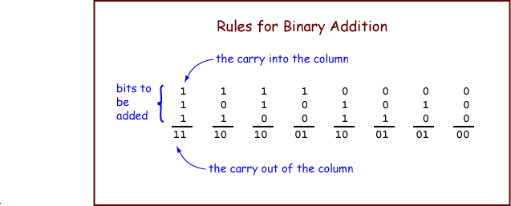

# Chapter 8 - Binary Addition and Two's Complement

Digital computers use bit patterns to represent many types of data. Various operations can be performed on data. Computers perform operations on bit patterns. With a good representation scheme, bit patterns represent data and bit pattern manipulations represent operations on data.

An important example of this is the **Binary Addition Algorithm**, where two bit patterns representing two integers are manipulated to create a third pattern which represents the sum of the integers.

## Chapter Topics:
* Single-bit Binary Addition Table
* Binary Addition Algorithm
* Addition in Hexadecimal Representation
* Sign-magnitude Representation
* Two's complement Representation
* Overflow detection in unsigned binary
* Overflow detection in two's complement binary

Most processor chips implement the Binary Addition Algorithm in silicon as part of their arithmetic logic unit. In a course in digital electronics you would study the hardware details of its implementation. This chapter only discusses the fundamentals of the algorithm.

### Question
<details>
    <summary>
    Compute the following. Give the answer in binary notation.
<pre>
    0 + 0 = ?
    0 + 1 = ?
    1 + 0 = ?
    1 + 1 = ?</pre>
    </summary>
    In binary:
<pre>
    0 + 0 = 0
    0 + 1 = 1
    1 + 0 = 1
    1 + 1 = 10</pre>
</details>

## 8.1 - The Binary Addition Algorithm
The binary addition algorithm is a bit-pattern manipulation procedure that is built into the hardware of (nearly) all computers. All computer scientists and computer engineers know it.  Simply put, it's how we add 2 binary numbers/patterns.



Let us start by adding 1-bit integers. The operation is performed on three bits. Arrange the bits into a column. The bit at the top of the column is called the "carry into the column". The operation produces a two-bit result. The left bit of the result is called the "carry out of the column".

To add two 1-bit (representations of) integers: Count the number of ones in a column and write the result in binary. The right bit of the result is placed under the column of bits. The left bit is called the "carry out of the column". The table shows the outcomes with all possible operands.

### Question
<details>
    <summary>
        Perform the following additions:
<pre>
  1             0             1
  0             1             1
  1             0             0  
----          ----           ---
</pre>
    </summary>
    In binary:
<pre>
  1             0             1
  0             1             1
  1             0             0  
 ----          ---           ---
 10            01            10
</pre>
</details>

## 8.2 - N-bit Binary Addition Algorithm
Adding a column of bits is as easy as counting. It is also easy to do electronically. It's a beginning project in many digital logic courses.

Now let us look at the full, n-bit, binary addition algorithm. The algorithm takes two operands and produces one result. An operand is the data that an algorithm operates on.

To add two N-bit (representations of) integers: Proceed from right-to-left, column-by-column, until you reach the left-most column. For each column, perform 1-bit addition. Write the carry-out of each column above the column to its left. The bit is the left column's carry-in.


The example above adds two 4-bit operands, `0110` and `0111`. The initial conditions are shown on the left. First, add up the bits in the right-most column. There is no carry-in to this column, so all you need to do is count the bits. The result is 1 with a carry of 0. Write the 1 as the result for the column, and put the carry above the next column. The picture shows this in blue. Continue right-to-left through the columns until all columns have been added. The carry-out of the right-most column should not go into the sum, but should be written to the right of the other carry bits.


### Question
<details>
    <summary>
        Confirm that this addition is correct. Convert the binary numbers to decimal.  Hopefully the decimal answers add up.
<pre>
  0110     =    _____ (base 10) 
+ 0111     =  + _____ (base 10)  
_______        ________
  1101     =    _____ (base 10) 
</pre>
    </summary>
<pre>
  6
+ 7
----
 13
</pre>
    Success!
</details>

## 8.3 - A Longer Example
Here is another example. Observe that the binary addition algorithm is the same algorithm you use with ordinary base ten addition, except now the base two addition table is used for each column.

<table>
<tr>
<td>
<pre style="text-align:right">         
  0110 1110
+ 0001 0111
 -----------         
</pre>
</td>
<td>
<pre style="text-align:right">
         0 
  0110 1110
+ 0001 0111
-----------
          1
</pre>
</td>
<td>
<pre style="text-align:right">
        10 
  0110 1110
+ 0001 0111
-----------
         01
</pre>
</td>
<td>
<pre style="text-align:right">
       110 
  0110 1110
+ 0001 0111
-----------
        101
</pre>
</td>

<td>
<pre style="text-align:right">
     1 110 
  0110 1110
+ 0001 0111
-----------
       0101
      
</pre>
</td>
</tr>

<tr>

<td>
<pre style="text-align:right">
    11 110 
  0110 1110
+ 0001 0111
-----------
     0 0101
</pre>
</td>

<td>
<pre style="text-align:right">
   111 110 
  0110 1110
+ 0001 0111
-----------
    00 0101
</pre>
</td>
<td>
<pre style="text-align:right">
  1111 110 
  0110 1110
+ 0001 0111
-----------
   000 0101
</pre>
</td>
<td>
<pre style="text-align:right">
  01111 110 
   0110 1110
 + 0001 0111
 -----------
   1000 0101
</pre>
</td>

<td>
&#160;
</td>
</tr>

<tr>
<td colspan="5">
<br />
The carry out of the left column in the final sum
can be discarded, in this case. <br />
But in general you
must be careful with it.  See the following pages.
<br />
<br />
</tr>

</table>

The carry out of the left column in the final sum can be discarded, in this case. But in general you must be careful with it. We'll talk more about this in a bit. 

Check the answer by converting to decimal representation and doing the addition in that base (the same numbers are being added, but now represented in a different way, so the sum is the same.)

 <pre> 
   01111 110
    0110 1110    =  110 (base 10)
  + 0001 0111    =   23 (base 10)
  -----------      -----
    1000 0101    =  133 (base 10)
</pre>

## 8.4 - Details, Details
Here are some details:

1. The correct application of the "Binary Addition Algorithm" sometimes gives incorrect results (because of overflow). With paper-and-pencil arithmetic, overflow is not a problem because you can use as many columns as needed.
2. Usually the operands and the result have a fixed number of bits (usually 8, 16, 32, or 64). These are the sizes that processors use to represent integers. 
3. To keep the result the same size as the operands, you may have to include zero bits in some of the leftmost columns. 
4. Compute the carry-out of the leftmost column, but don't write it as part of the answer (because there is no room if you have a fixed number of bits.)
5. When the operands are represented using the **unsigned binary** scheme (the base two representation scheme discussed in the last two chapters) a carry-out of  1  from the leftmost column means the sum does not fit into the fixed number of bits. This is called **overflow**.
6. When the operands are represented using the **two's complement** scheme (which will be described at the end of this chapter), then a carry-out of  1  from the leftmost column is not necessarily overflow.

Integers may be represented using a scheme called *unsigned binary* or using a scheme called *two's complement* binary. The binary addition algorithm is used with both schemes, but to interpret the result you need to know what scheme is being used. Overflow is detected in different ways with each scheme (see details 4 and 5, above.)


### Question
<details>
    <summary>
        The ARM chip has 32-bit registers. What do you think is the usual size of the operands when binary addition is performed?
    </summary>
        32 bits
</details>

## 8.5 - Overflow Detection
Here is an addition problem using 4-bit operands:

<pre>
 1111
  0111
+ 1001
------
  0000
</pre>
 
Overflow happened!

Two four-bit numbers are added, but the sum does not fit in four bits. If we were using five bits the sum would be `1 0000`. But with four bits there is no room for the left-most "1". Because the carry out from the most significant column of the sum is "1", the 4-bit result is not valid. The column is called the **most significant** column because it corresponds to the highest power of two. The bits in the leftmost columns are called the **most significant bits** or the **high-order bits**.

The electronic circuits of a processor can easily detect overflow of unsigned binary addition by checking if the carry-out of the leftmost column is a zero or a one. A program might branch to an error handling routine when overflow is detected.

### Question
<details>
    <summary>
        Add these unsigned numbers, represented in eight bits. Determine if overflow occurs.
<pre>
   0010 1100
 + 0101 0101
 -----------
 </pre>
    </summary>
    <pre>
        0 1111 100
          0010 1100
        + 0101 0101
        -----------  
          1000 0001
</pre>  
No overflow.
</details>

## 8.6 Negative Integers
Unsigned binary representation can not be used to represent negative integers. With paper and pencil numbers, a number is made negative by putting a negative sign in front of it: 24<sub>10</sub> negated = -24<sub>10</sub>. You might hope to do the same with binary integers:

```     0001 1000    negated =   -0001 1000  ???```

Unfortunately, you can't put a negative sign in front of a bit pattern in computer memory. Memory holds only patterns of 0's and 1's. Somehow negative integers must be represented using bit patterns. But this is certainly possible. Remember those advantages of binary?

1. Easy to build.
2. Unambiguous signals (hence noise immunity).
3. Can be copied flawlessly.
4. **Anything that can be represented with symbols can be represented with patterns of bits.**
If we can represent negative integers with paper and pencil (thus using symbols) we certainly can represent negative integers with patterns of bits.

### Question
<details>
    <summary>
Let us say that you need to represent an equal number of positive and negative integers in eight bits. How many negative numbers can represented? How many positive numbers? Just for fun, can you think of a way to do this? Get out some scratch paper and scratch for a while with eight-bit patterns.
    </summary>
Since there are 256 possible bit patterns with 8 bits, there could be 128 positive and 128 negative integers.
You may have thought of the sign-magnitude method, discussed next.
</details>

## Sign-Magnitude Representation
There are many schemes for representing negative integers with patterns of bits. One scheme is sign-magnitude. It uses one bit (usually the leftmost) to indicate the sign. "0" indicates a positive integer, and "1" indicates a negative integer. The rest of the bits are used for the magnitude of the number. So -24<sub>10<sub> is represented as:

```    1001 1000```

The sign "1" means negative
The magnitude is 24 (in 7-bit binary)

### Question
<details>
    <summary>
        With 8-bit sign-magnitude representation, what positive integers can be represented and what negative integers can be represented?
    </summary>
    -127<sub>10</sub> ... 0 ... +127<sub>10</sub>
</details>

## Problems with Sign-Magnitude
There are problems with sign-magnitude representation of integers. Let us use 8-bit sign-magnitude for examples.

The leftmost bit is used for the sign, which leaves seven bits for the magnitude. The magnitude uses 7-bit unsigned binary, which can represent 0<sub>10</sub> (as `000 0000`) up to 127<sub>10</sub> (as `111 1111`). The eighth bit makes these positive or negative, resulting in   -127<sub>10</sub>, ... -0, 0, ... 127<sub>10</sub>.

One pattern corresponds to "minus zero", `1000 0000`. Another corresponds to "plus zero", `0000 0000`.

There are several problems with sign-magnitude. It works well for representing positive and negative integers (although the two zeros are bothersome). But it does not work well in computation. A good representation method (for integers or for anything) must not only be able to represent the objects of interest, but must also support operations on those objects.

This is what is wrong with Roman Numerals: they can represent positive integers, but they are very poor when used in computation.

### Question
<details><summary>
    Can the "binary addition algorithm" be used with sign-magnitude representation? Try adding +16 with -24:
<pre> 
  0001 0000     16
  1001 1000    -24 
------------   ----
</pre>
    </summary>
    <pre>
       1
     0001 0000     16
     1001 1000    -24 
     ---------    ---
     1010 1000    -40 (wrong!)
    </pre>
    </details>

## Patterns that Add Up to Zero
The "binary addition algorithm" does NOT work with sign-magnitude. There are algorithms that do work with sign-magnitude, and some early computers were built to use them. (And other computers were built using other not-ready-for-prime-time algorithms). It took several years of experience for computer science to decide that a better way had to be found.

There is a better way. Recall a question and its answer from several pages ago:

```
  11111 111
   0000 0001  =   1
   1111 1111  =   ? 
   ----------     --
   0000 0000  =   0
```

In other words, a number added to one results in a zero. What could that number be?  Well, -1, obviously.

Negative one added to positive one gives zero. So if a particular bit pattern results in the pattern that represents zero when added to one, it can represent minus one.

```
  11111 111
   0000 0001  =    1
   1111 1111  =   -1 
   ---------      ---
   0000 0000  =    0
```
There is a carry out of one from the high order column, but that is fine in this situation. The "binary addition algorithm" correctly applied gives the correct result in the eight bits. Look at another interesting case:
```
  11111 11
   0000 1110  =   14
   1111 0010  =    ?
   ---------      --
   0000 0000  =    0
```
So the pattern `1111 0010` might be a good choice to represent -14!

For every bit pattern of N bits there is a corresponding bit pattern of N bits which produces an N-bit zero when the two patterns are used as operands for the binary addition algorithm. Each pattern can be thought of as representing the negative of the number that is represented by the other pattern.

### Question
<details><summary>
    Find the 8-bit pattern that gives eight zero-bits when added to the bit pattern for 610. (Hint: start at the right column, figure out what the ? has to be in each column, and work your way left.)
<pre> 
  0000 0110  =  6
  ???? ????  = -6
  —————————    ————
  0000 0000     0
</pre>
    </summary>
    <pre>
  0000 0110  =  6
  1111 1010  = -6
  —————————    ————
  0000 0000     0
    </pre>
    </details>
    
## Two's Complement
This representation scheme is called **two's complement**. It is one of many ways to represent negative integers with bit patterns. But it is now the nearly universal way of doing this. Integers are represented in a fixed number of bits. Both positive and negative integers can be represented. When the pattern that represents a positive integer is added to the pattern that represents the negative of that integer (using the "binary addition algorithm"), the result is zero. The carry out of the left column is discarded.

Here is how to figure out which bit-pattern gives zero when added (using the "binary addition algorithm") to another pattern.

How to Construct the Negative of an Integer in Two's Complement:
* Start with an N-bit representation of an integer.
* To calculate the N-bit representation of the negative integer:
  * Reflect each bit of the bit pattern (change 0 to 1, and 1 to 0).
  * Add one.
This process is called **forming the two's complement** of N. 

An example:
```
The positive integer: 0000 0001   ( one )
Reflect each bit:     1111 1110   
Add one:              1111 1111   ( minus one )
```

### Question
<details>
    <summary>
        Fill in the blanks:
        <pre>
The positive integer: 0000 0110     ( 6 )
Reflect each bit: __________________  
Add one:   ___________________   ( -6 )
</pre>
    </summary>
    The positive integer: 0000 0110    (6)<br>
    Reflect each bit:     1111 1001<br>
Add one:              1111 1010     <br>
The result is the same representation for minus six as we figured out before.
    </details>
    
## Two's Complement Integers
What is the two's complement of zero?
```
      zero =  0000 0000
   reflect =  1111 1111
   add one =  0000 0000
```
Using the algorithm with the representation for zero results in the representation for zero. This is good. Usually "negative zero" is regarded as the same thing as "zero". Recall that with the sign-magnitude method of representing integers there where both "positive" and "negative" zero.

What integers can be represented in 8-bit two's complement? Two's complement represents both positive and negative integers. So one way to answer this question is to start with zero, check that it can be represented, then check one, then check minus one, then check two, then check minus two ... Let's skip most of those steps and check 127(sub>10</sub>:
```
       127 =  0111 1111            check:   0111 1111
   reflect =  1000 0000                     1000 0001 
   add one =  1000 0001                     0000 0000 
      -127 =  1000 0001
```
### Question
<details>
    <summary>
        Now try to compute the negative of 128<sub>10</sub>.
        <pre>
       128  =  1000 0000
   reflect  =  ______________
   add one  =  _______________
   </pre>
    </summary>
    <pre>
       128  =  1000 0000
   reflect  =  0111 1111
   add one  =  1000 0000   ??????
    </pre>
    </details>
    
## Range of Integers with 2's Complement
It looks like +128 and -128 are represented by the same pattern. This is not good. A non-zero integer and its negative can't both be represented by the same pattern. So +128 can not be represented in eight bits. The maximum positive integer that can be represented in eight bits is 127<sub>10</sub>.

What number is represented by 1000 0000? Add the representation of 127<sub>10</sub> to it:

```
   1000 0000    = ?
   0111 1111    = 127
   1111 1111    =  -1
```
A good choice for ? is -128<sub>10</sub>. Therefore `1000 0000` represents -128<sub>10</sub>. Eight bits can be used to represent the numbers  -128<sub>10</sub> ... 0 ... +127<sub>10</sub>.

**Range of N Bit 2's Complement**
-( 2<sup>(n-1)</sup> )  ... 0 ... 2<sup>(n-1)</sup> - 1

For example, the range of integers that can be represented in eight bits using two's complement is:

-( 2<sup>(8-1)</sup> ) = -128  ... 0 ... 2<sup>(8-1)</sup> - 1 = 127

Notice that one more negative integer can be represented than positive integers.

### Question
<details>
    <summary>
        How many integers are there in the range  -128 ... 0 ... +127  ?  How bit patterns can be formed with 8 bits?
    </summary>
    256 and 256.  Every pattern of the 256 patterns has been assigned an integer to represent.  This is good!
    </details>
    
## The "Sign Bit"
The algorithm that creates the representation of the negative of an integer works with both positive and negative integers. Start with N and form its two's complement: you get -N. Now complement -N and you get the original N.

```
0110 1101     reflect →  1001 0010     add one →  1001 0011
1001 0011     reflect →  0110 1100     add one →  0110 1101
```

With N-bit two's comp representation, the high order (leftmost) bit is "0" for positive integers and "1" for negative integers. This is a fortunate result. The high order bit is sometimes called the sign bit. But it is not really a sign (it does not play a separate role from the other bits). It takes part in the "binary addition algorithm" just as any bit.

### Question
<details>
    <summary>
Does the following four-bit two's complement represent a negative or a positive integer? 1001
    </summary>
negative
</details>

Be sure that you understand this: it is by happy coincidence that the high order bit of a two's complement integer is 0 for positive and 1 for negative. But, to create the two's complement representation of the negative of a number you must "reflect, add one". Changing the sign bit by itself will not work.

To convert N bits of two's complement representation into decimal representation:
1. If the integer is negative, complement it to get a positive integer.
2. Convert (positive) integer to decimal (as usual).
3. If the integer was originally negative, put "-" in front of the decimal representation.

The number represented by 1001 is negative (since the "sign bit" is one), so complement:

```
1001 →  0110 + 1 →  0111
```

Convert the result to decimal:  0111 = 7<sub>10</sub>.  Add a negative sign:   -7<sub>10</sub>.  So (in 4-bit two's complement representation) 1001 represents -7<sub>10</sub>.

### Question
<details>
    <summary>
        What is the decimal representation of this 8-bit two's complement integer: 1001 1111
    </summary>
     First note that the "sign bit" is set, so the integer is negative. Then find the positive integer:
 <pre>
 1001 1111    reflect →   0110 0000    add one →  0110 0001
</pre>
 convert to decimal   →  26 + 25 + 1  =  97 <br>
 put sign in front    →  -97
    </details>
